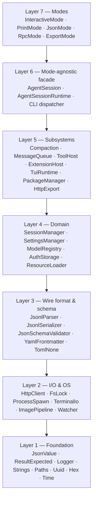
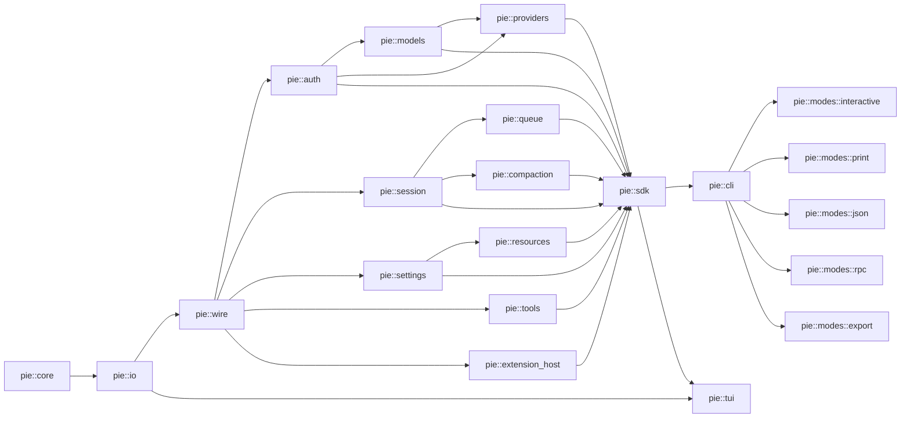
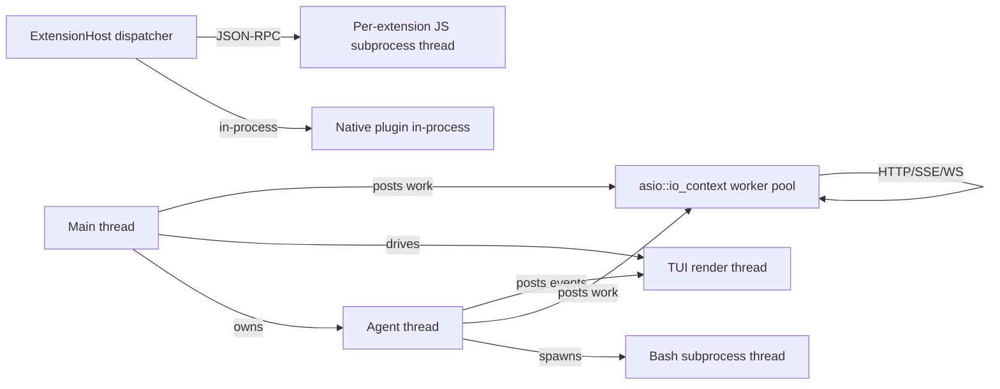
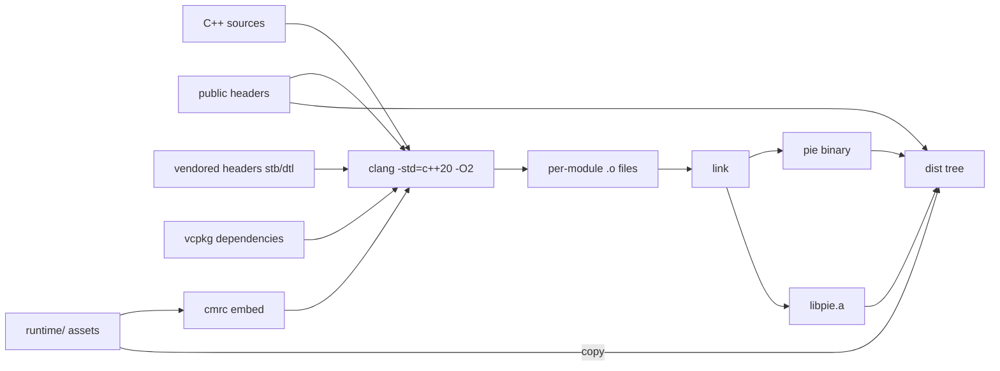
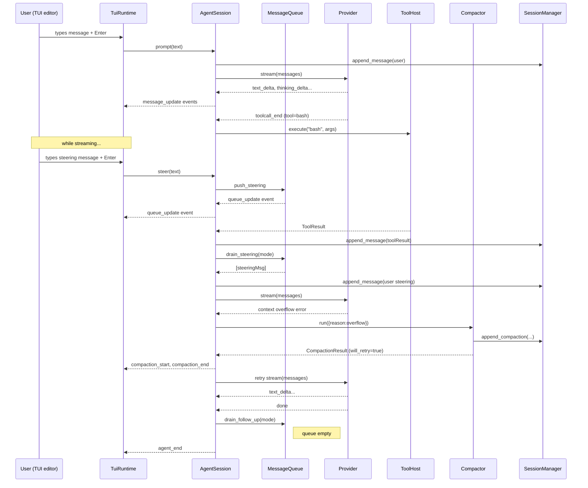
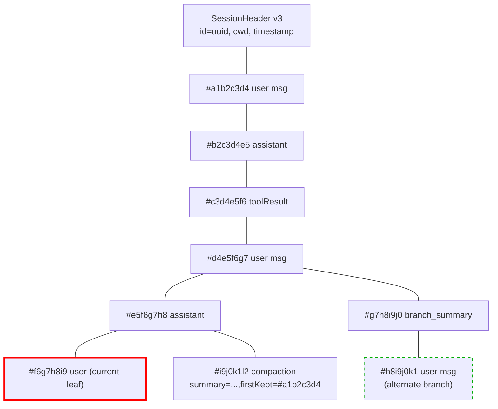
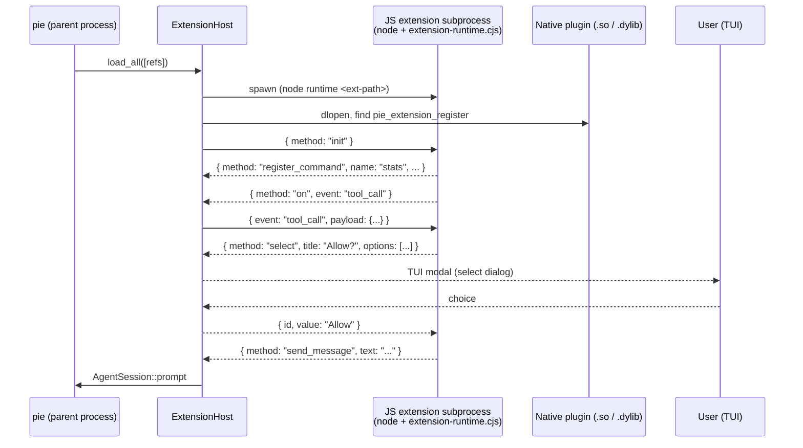
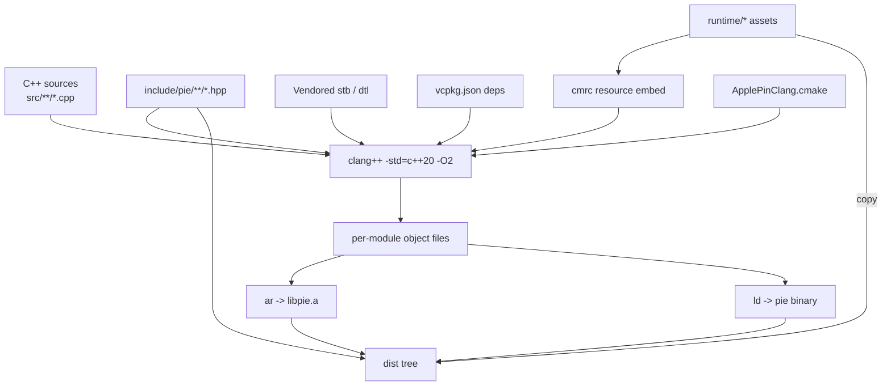
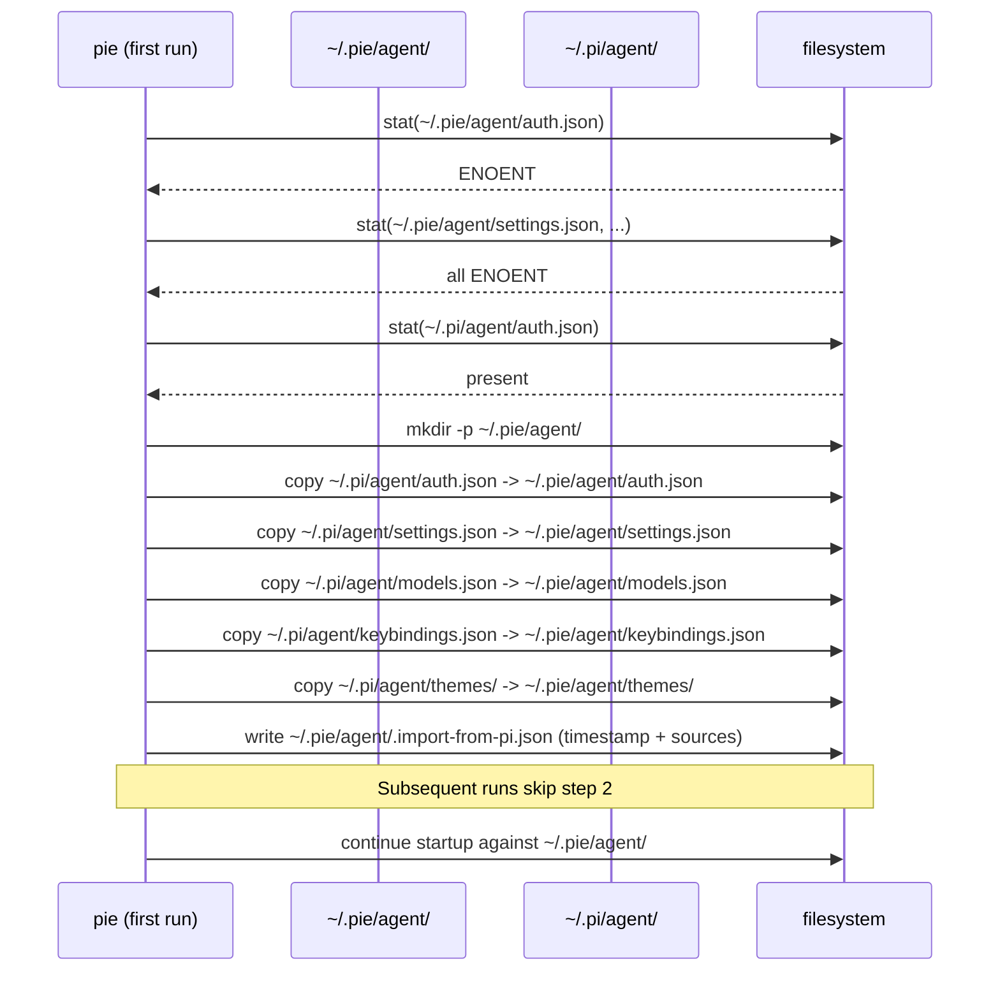

# Design Document

## Overview

Pie_Cpp is a clean, native C++20 re-implementation of the TypeScript application `@earendil-works/pi-coding-agent` (Pi_TS) located in `coding-agent/`. The new implementation lives entirely under `pie-coding-agent/` at the repository root and MUST NOT modify any file under `coding-agent/`. The primary build target is macOS arm64 with Apple clang 17.0.0; the secondary target is macOS x86_64. Linux x86_64 and aarch64 are supported but secondary; Windows is explicitly out of scope.

The build produces two artifacts:

1. **`pie`** — a single-binary CLI at `pie-coding-agent/build/pie`, replacing Pi_TS's `pi` entry point. The binary reads and writes the same on-disk JSON/JSONL formats as Pi_TS so existing user data continues to work, and on first run it imports `~/.pi/agent/` into Pie_Cpp's namespace at `~/.pie/agent/`.
2. **`libpie`** — a static library at `pie-coding-agent/build/libpie.a` (with optional shared variant) plus public headers at `pie-coding-agent/include/pie/`, replacing Pi_TS's `createAgentSession` / `createAgentSessionRuntime` SDK with C++ equivalents.

### Binary + SDK split

The binary is a thin wrapper around the SDK. All non-trivial behavior — session manipulation, settings merging, model registry, agent loop, compaction, tool dispatch, extensions, modes — lives in the SDK library. The CLI layer parses argv, decides which mode to launch, and hands control to one of `pie::InteractiveMode`, `pie::PrintMode`, `pie::JsonMode`, `pie::RpcMode`, or the export/package subcommands. This keeps the SDK's public surface in lockstep with the CLI's behavior and makes conformance testing against Pi_TS-produced fixtures straightforward.

### Extension model

Extensions are the most architecturally significant divergence from Pi_TS. Pi_TS extensions are TypeScript modules executed in-process. Pie_Cpp adopts a **hybrid model**:

- **JS extensions** (`.ts` / `.js` / `.mjs`) are executed in an **out-of-process Node child** spawned by the parent `pie` process. Communication is over a **JSON-RPC bridge** mirroring the RPC mode framing (LF-delimited JSONL on stdin/stdout). This preserves the existing extension ecosystem byte-for-byte (the same `ExtensionAPI` surface, the same lifecycle hooks, the same `package.json` package shapes).
- **C++ extensions** (`.so` / `.dylib`) implement a small native plugin ABI defined under `pie-coding-agent/include/pie/extension/`, loaded via `dlopen`. The native ABI exposes the same conceptual `ExtensionAPI` to C++ authors via a vtable, but is not byte-compatible with Pi_TS extension JS.

Both flavors plug into a common in-process `ExtensionHost` that fans events out to subscribers. This is described in detail in §3 (Extension subsystem) and §8 (Extension protocol diagram).

### Top-level lifecycle

Every `pie` invocation follows the same lifecycle, regardless of mode:

1. Parse argv into a `CliInvocation` value and detect mode conflicts (Req 2.9).
2. Resolve `Agent_Dir` (from `PIE_CODING_AGENT_DIR` or default `~/.pie/agent`), `Session_Dir`, and `cwd`.
3. Run **first-run import** if `Agent_Dir` is missing the canonical files but `~/.pi/agent/` has them (Req 23.8 / 23.9).
4. Load `auth.json`, `settings.json` (global + project, deep-merged), `models.json`, `keybindings.json`, and themes.
5. Construct services: `AuthStorage`, `ModelRegistry`, `SettingsManager`, `SessionManager`, `ResourceLoader` (which discovers extensions, skills, prompt templates, context files, themes).
6. Boot the `ExtensionHost` and initialize loaded extensions (waiting for any async factories per Pi_TS semantics).
7. Resolve the active model and thinking level (CLI flags > session > settings > defaults).
8. Optionally perform startup network operations (update check, install/update telemetry) gated by `--offline` / `PIE_OFFLINE` / `PIE_SKIP_VERSION_CHECK`.
9. Hand control to the selected mode driver.
10. On exit, flush settings, release file locks, send `agent_end` / mode-shutdown events, and write any pending diagnostics.

The full state machine is captured in §3 (System Components) and §4 (Concurrency).

## Architecture

### Layered architecture

The codebase is organized into seven horizontal layers. Lower layers never depend on higher layers.



Each layer is implemented as a CMake static library target so the dependency direction is enforced at link time. The Pie_Cpp_SDK public surface is the union of selected types from layers 4–6; `pie-coding-agent/include/pie/` re-exports them.

### Module boundaries

Within each layer, modules are independent translation units (CMake libraries) that depend on each other only via header-declared interfaces. Concrete bindings live in `.cpp` files. This minimizes recompilation and makes the mock/fake substitutions for tests cheap.

| Module | Owns | Depends on |
|--------|------|-----------|
| `pie::core` (L1) | `JsonValue`, `Result<T,E>`, `Logger`, paths, UUIDs, hex IDs, time | — |
| `pie::io` (L2) | HTTP client, file locking, process spawn, signal handling, terminal I/O, fs watcher | `pie::core` |
| `pie::wire` (L3) | JSONL parser/serializer, JSON Schema, YAML frontmatter, diff | `pie::core`, `pie::io` |
| `pie::auth` (L4) | `AuthStorage`, OAuth flows, API key resolver | `pie::wire`, `pie::io` |
| `pie::session` (L4) | `SessionManager`, tree, migrations, file lock orchestration | `pie::wire`, `pie::io` |
| `pie::settings` (L4) | `SettingsManager`, deep merge, env-var resolution | `pie::wire`, `pie::io` |
| `pie::models` (L4) | `ModelRegistry`, models.json, model selector resolution | `pie::wire`, `pie::auth` |
| `pie::resources` (L4) | `ResourceLoader` (extensions, skills, prompts, themes, AGENTS.md) | `pie::wire`, `pie::settings` |
| `pie::tools` (L5) | Tool interface, the seven built-ins, `Tool_Allowlist` | `pie::wire`, `pie::io` |
| `pie::compaction` (L5) | Manual / threshold / overflow / branch summary | `pie::session`, `pie::models` |
| `pie::queue` (L5) | Steering / follow-up FIFO, delivery modes | `pie::session` |
| `pie::providers` (L5) | Per-provider HTTP clients, transport (SSE/WebSocket/stream), retry | `pie::auth`, `pie::models`, `pie::io` |
| `pie::extension_host` (L5) | Extension lifecycle, event fan-out, JS subprocess bridge, native ABI | `pie::wire`, `pie::io` |
| `pie::tui` (L5) | Frame loop, layout, theme, image protocols, modals | `pie::io`, `pie::resources` |
| `pie::sdk` (L6) | `AgentSession`, `AgentSessionRuntime`, public headers | All L4/L5 |
| `pie::cli` (L7) | argv parsing, mode dispatch, package subcommands, `@file` expansion | `pie::sdk` |
| `pie::modes_*` (L7) | Each mode is its own target | `pie::sdk` |

### Threading and async model

Pie_Cpp uses **`asio::io_context`** as the single async runtime, plus a small set of dedicated threads for blocking work that cannot reasonably be made async on macOS (file watchers fall back to FSEvents/kqueue, terminal I/O uses raw POSIX). The model:

- **Main thread** owns the CLI argv parse, the mode driver lifecycle, and the eventual exit.
- **`io_context` worker pool** (1–N threads, default `min(4, hardware_concurrency)`) runs HTTP, OAuth polling, JSON-RPC framing, and provider streaming work. All long-lived async work is expressed as coroutines (`asio::awaitable` with C++20 `co_await`).
- **TUI render thread** owns the terminal frame loop in interactive mode (locked to ~30 FPS or input-driven). It receives state diffs from the agent thread via a lock-free MPSC ring; it never blocks on agent work.
- **Agent thread** runs the `AgentSession::prompt` loop. It posts events to subscribers via the same `io_context` (fan-out is synchronous within the dispatch but bounded). One agent thread per `AgentSession`.
- **Bash subprocess thread** is a dedicated thread per running `bash` tool call, blocking on `read()` from the child's pipe. Cancellation closes the pipe and signals the child (Req 12.5).
- **Extension subprocess threads** — one per JS-extension subprocess, blocking on stdout/stderr reads, marshaling JSON-RPC frames into the `io_context`.

Cancellation is propagated via `asio::cancellation_signal` chained through the agent loop. Esc in interactive mode triggers the root signal; subordinate operations (provider streaming, bash, compaction) observe the signal and tear down gracefully.

### Dependency graph




## Technology Stack

Every concern below is pinned to a single immutable version (Req 1.6). The manifest format is **vcpkg.json** (overlay ports for anything not on the public registry); alternatives evaluated and rejected: Conan (worse macOS arm64 binary cache story for niche libraries), git submodules (loses overlay-port + version-pin metadata), CPM (no manifest auditability).

| Concern | Choice | Pinned version | Rationale |
|---|---|---|---|
| Build system | **CMake 3.27.x** | `3.27.9` | Native first-class macOS support; ships with Apple toolchains; vcpkg integration. |
| Standard | C++20 | n/a | Required by Req 1.4. No C++23 features used (no `std::expected` from `<expected>`; we ship our own — see below). |
| Compiler | Apple clang | `17.0.0` (enforced) | Req 1.11 mandates exact match on macOS. Linux uses upstream clang 17.0.0 or gcc 13.2 as documented. |
| Dependency manifest | **vcpkg.json** | manifest-mode, baseline `2024.05.24` | Pinned baseline; overlay ports for anything missing. |
| JSON | **nlohmann/json** | `3.11.3` | The wire format requires preserving unknown keys (Req 23.7) and stable key order; nlohmann's `ordered_json` gives us this. simdjson is faster but its DOM is read-only and lacks the round-trip preservation we need. We keep a *pluggable adapter* so a future selective use of simdjson for hot parse paths is non-breaking. |
| HTTP | **libcurl** | `8.7.1` (system or vcpkg) | Battle-tested, supports SSE via `CURLOPT_WRITEFUNCTION` chunked callbacks. We wrap it in a small `pie::io::HttpClient`. WebSocket support: libcurl 7.86+ has built-in WS, but for production we use **cpp-httplib** (header-only `0.15.3`) for the gist upload edge cases and our **own `WebSocketClient`** built on top of asio TLS streams for provider WebSocket transport. |
| TLS | **OpenSSL** | `3.2.1` | Vendored via vcpkg; consistent across macOS arm64/x86_64 and Linux. macOS Secure Transport is deprecated by Apple, so we avoid it. |
| TUI | **FTXUI** | `5.0.0` | Pure C++ TUI library, supports the layout/widget primitives we need (vertical/horizontal flex, modals, focus). Hand-rolled would be too costly for the modal/selector surface. ncurses rejected because the FTXUI Component model fits Pi_TS's reactive-rerender style. We do **not** use FTXUI's screen renderer for image protocol work — escape sequences are emitted directly via raw stdout. |
| File locking | **boost::interprocess::file_lock** | Boost `1.84.0` | Cross-platform, semantics compatible with `proper-lockfile` when wrapped: we implement the `<file>.lock` sibling-file convention from Req 3.10 on top of `file_lock` for byte-equivalence with Pi_TS. |
| Image decode | **stb_image** | commit `5c20573` (vendored) | Header-only, zero-dependency. Supports PNG/JPEG/GIF/WebP per Req 20.1. |
| Image resize | **stb_image_resize2** | commit `5c20573` (vendored) | Pairs with stb_image; 2-pixel tolerance from Req 20.3 is well within stb's accuracy. |
| EXIF | **libexif** | `0.6.24` | Tiny, BSD-licensed; we only need Orientation per Req 20.5. Fallback hand-rolled parser for the Orientation tag exists if libexif fails. |
| Image render | **Hand-rolled escape sequences** | n/a | Kitty graphics protocol, iTerm2 inline images, Sixel — all directly emitted per Req 20.7. We detect terminal support via `TERM`, `KITTY_WINDOW_ID`, `TERM_PROGRAM`, and DA1/DA2 query response. |
| Process spawn | **POSIX `posix_spawn`** | n/a | Boost.Process vendors a heavy dependency tree we don't need. We wrap `posix_spawn`/`posix_spawnp` with a small `Subprocess` class. |
| JSON Schema | **valijson** | `1.0.2` | Header-only, schema validator that pairs with nlohmann/json via an adapter. We need it for `defineTool` parameter validation (Req 22.7). |
| YAML | **rapidyaml** | `0.7.0` | Faster and smaller than yaml-cpp. We use it only for prompt-template / SKILL.md frontmatter, where the input is small. |
| Diff | **dtl** | commit `f3a1b22` | Header-only Myers diff; produces unified-diff output matching Pi_TS for `edit` tool `details.diff`. |
| Glob / fnmatch | **System `glob.h`** + **custom `Globber`** | n/a | macOS and Linux `glob.h` give us POSIX glob; we add a small extension layer for `**` recursive matching to match Pi_TS's `glob` package and `minimatch`. |
| Concurrency | **standalone Asio** | `1.30.2` | Coroutine-friendly (`asio::awaitable`), no Boost dep, smaller surface than Boost.Asio. We use `std::jthread` for the few worker threads. |
| Watcher | **efsw** | `1.0.1` | Cross-platform fs watcher. macOS uses FSEvents, Linux inotify. Used for theme hot reload (Req 15.6). |
| Result type | **tl::expected** | `1.1.0` | Drop-in `std::expected`-like for C++20. We typedef `pie::Result<T, E>` to it. |
| Argv parsing | **CLI11** | `2.4.1` | Header-only, supports the Pi_TS argv shape (`@file` positionals, mode flags) cleanly. We post-process for conflict detection (Req 2.9). |
| OAuth / device-code | Hand-rolled on top of HttpClient | n/a | The Anthropic, OpenAI Codex, and GitHub Copilot device-code flows are well-documented and small. No off-the-shelf C++ OAuth library covers all three. |
| Telemetry | Hand-rolled HTTP POST | n/a | Single endpoint, single payload shape (Req 21.2). |
| Logging | Custom stderr writer | n/a | Bounded format aligning with Req 24.1. |
| Embedded JS runtime | **Out-of-process Node** (`node>=22.19`) | external | We don't embed v8/quickjs. Subprocess is `node` from `PATH` or `NODE` env var. See Extension subsystem below. |
| Native plugin ABI | Hand-rolled C ABI | n/a | `dlopen`/`dlsym` against `extern "C"` registration entry point. |

### Out-of-process Node detail

When a JS extension is loaded, the parent process spawns:

```
${NODE:-node} --experimental-strip-types <pie-coding-agent>/runtime/extension-runtime.cjs <extension-path>
```

The runtime script is shipped with the binary at `pie-coding-agent/runtime/`. It loads the user's extension via `jiti` (same module loader Pi_TS uses today) and exposes the `ExtensionAPI` over JSON-RPC on stdin/stdout. This is documented in the Extension subsystem below.

If `node` is not present on `PATH`, JS extensions are silently skipped with a one-line diagnostic per extension (Req 17.10), but `pie --version` still exits 0 (Req 1.9 — note that Req 1.9 only requires `--version` to not spawn node/npm/bun/deno; it does not preclude spawning them later for user-requested operations like `pie install` or extension loading).


## Components and Interfaces

This section walks through every major subsystem with concrete C++ class shapes. The headers shown are illustrative — the canonical declarations live under `pie-coding-agent/include/pie/` (public) or `pie-coding-agent/src/` (internal).

### Session subsystem (`pie::session`)

The session subsystem owns reading, writing, and navigating Session_Files. The on-disk format is the JSONL tree described in `coding-agent/docs/session-format.md`; the C++ implementation must round-trip it byte-equivalently for canonical lines (Req 3.11–3.13).

#### Key types

```cpp
namespace pie::session {

// 8-character lowercase hex, generated via cryptographically secure RNG.
struct EntryId {
    std::array<char, 8> chars;
    std::string str() const;
    bool operator==(const EntryId&) const = default;
};

// SessionEntry is a discriminated union over every entry type defined in
// coding-agent/docs/session-format.md. We keep the original parsed JsonValue
// (preserving unknown keys) alongside the typed view, so round-tripping
// preserves any field we don't know about (Req 23.7).
struct SessionEntry {
    EntryKind kind;                       // session|message|compaction|...
    std::optional<EntryId> id;            // null only for session header
    std::optional<EntryId> parent_id;     // null for first non-header entry
    std::string timestamp;                // ISO-8601, preserved verbatim
    pie::core::JsonValue raw;             // original parsed object, unknown keys retained
    EntryPayload payload;                 // typed view, populated lazily
};

class SessionFile {
public:
    static pie::Result<SessionFile> open(std::filesystem::path);
    static pie::Result<SessionFile> create(std::filesystem::path, std::string_view cwd);

    const SessionHeader& header() const noexcept;
    std::span<const SessionEntry> entries() const noexcept;

    // Atomic crash-safe append: write entry+\n, fsync, rename .tmp lock release.
    pie::Result<EntryId> append(SessionEntry);

    // Used for migration only. Rewrites the file with the migrated entries
    // under a sibling .lock file; never partially overwrites.
    pie::Result<void> rewrite_v1_or_v2_to_v3();

private:
    std::filesystem::path path_;
    SessionHeader header_;
    std::vector<SessionEntry> entries_;
    pie::io::FileLock lock_;  // sibling <path>.lock
};

class SessionTree {
public:
    explicit SessionTree(SessionFile&);
    std::optional<EntryId> leaf_id() const noexcept;
    const SessionEntry* get(EntryId) const noexcept;
    std::vector<const SessionEntry*> branch_to_root(std::optional<EntryId> from = {}) const;
    std::vector<EntryId> children(EntryId parent) const;
    std::optional<std::string> label(EntryId) const;
    void set_leaf(std::optional<EntryId>);
    pie::Result<EntryId> append(SessionEntry);

    // Build_Session_Context per Req 4.7
    BuildResult build_session_context() const;
};

class SessionManager {  // public SDK type
public:
    static pie::Result<SessionManager> create(std::filesystem::path cwd, std::optional<std::filesystem::path> session_dir = {});
    static pie::Result<SessionManager> open(std::filesystem::path file, std::optional<std::filesystem::path> session_dir = {});
    static pie::Result<SessionManager> continue_recent(std::filesystem::path cwd, std::optional<std::filesystem::path> session_dir = {});
    static SessionManager in_memory(std::optional<std::filesystem::path> cwd = {});
    static pie::Result<SessionManager> fork_from(std::filesystem::path src, std::filesystem::path target_cwd, std::optional<std::filesystem::path> session_dir = {});

    // Listing (Req 4.2)
    static std::vector<SessionListEntry> list(std::filesystem::path cwd, std::optional<std::filesystem::path> session_dir = {}, ListProgress* on_progress = nullptr);
    static std::vector<SessionListEntry> list_all(ListProgress* on_progress = nullptr);

    // All append/getEntry/getBranch/branch methods per Req 4.3-4.6
    pie::Result<EntryId> append_message(AgentMessage);
    pie::Result<EntryId> append_thinking_level_change(ThinkingLevel);
    pie::Result<EntryId> append_model_change(std::string_view provider, std::string_view model_id);
    pie::Result<EntryId> append_compaction(std::string summary, EntryId first_kept, std::int64_t tokens_before,
                                            std::optional<pie::core::JsonValue> details = {},
                                            std::optional<bool> from_hook = {});
    // ... see "Public API (SDK)" section.
};

}  // namespace pie::session
```

#### File locking

`pie::io::FileLock` implements the `proper-lockfile` convention (Req 3.10):

- The lock path is `<session-file>.lock`.
- Acquisition tries `open(O_CREAT | O_EXCL | O_RDWR, 0600)`; on `EEXIST` we read the existing lockfile to inspect its mtime.
- If the existing lockfile's mtime is older than 10 s (the stale threshold), we replace it.
- Otherwise we sleep 50 ms (capped at 100 ms per try) and retry, total wall-clock ≤ 10 s.
- On release we `unlink` the lockfile.

The on-disk byte format of the lockfile is `<pid>\n` to match `proper-lockfile` cross-process visibility, so a Pi_TS write that races against a Pie_Cpp write either blocks the loser cleanly or reports a stale lock.

#### Atomic append for crash safety (Req 3.15)

Naive `write(fd, line, len)` is not atomic on macOS for lengths beyond `PIPE_BUF`. To guarantee Req 3.15 (no partial line on crash):

1. Acquire the file lock.
2. `lseek` to end of file.
3. Build the entire serialized line (including trailing `\n`) into a `std::string` in memory.
4. `write` the buffer in a loop until done.
5. `fsync(fd)`.
6. Release the lock.

The crash window between step 4 and step 5 leaves the file in a state that is still well-formed JSONL — every previously-fsync'd line is intact, and the just-written line is either fully present or fully absent because step 4 buffers in the kernel page cache atomically for ≤4 KiB writes (and our serialized lines are well under 4 KiB after compaction). For lines exceeding 4 KiB (very large content blocks), we use a `O_APPEND | O_WRONLY` fd which the kernel guarantees to atomically advance the file offset under the page-cache write per the macOS HFS+/APFS guarantees, with `fsync` for durability before lock release.

#### JSONL parser and serializer

The parser is line-oriented:

```cpp
namespace pie::wire {

class JsonlParser {
public:
    explicit JsonlParser(std::string_view bytes);
    std::optional<ParseResult> next();  // returns (line_no, JsonValue) or error per Req 3.14
};

class JsonlSerializer {
public:
    // Canonical pretty printer per Req 3.13. No insignificant whitespace,
    // key order matches docs/session-format.md.
    static std::string serialize_entry(const SessionEntry&);
    static std::string serialize_header(const SessionHeader&);
};

}
```

The canonical key order for each entry type is encoded as a static `constexpr` array in the serializer. The serializer iterates the source `JsonValue` in canonical order, then appends any unknown keys at the end in their original parse order. This preserves Req 23.7 (unknown keys round-tripped) while still being deterministic for known fields.

#### Migration v1/v2 → v3 (Req 23.1–23.5)

Migration runs on load. The flow:

1. Read the header. If `version` is `1` or `2`, enter migration path.
2. **v1**: walk entries in file order. Assign each a fresh `EntryId`. Set `parentId` to the previous entry's `id` (or `null` for the first). Hold the migrated tree in memory.
3. **v2**: walk entries. For each `message` entry whose `message.role == "hookMessage"`, change role to `"custom"`. Preserve every other key.
4. After migration succeeds in memory, the next persisted append writes a new file body with `version: 3` (Req 23.3). This is implemented as `SessionFile::rewrite_v1_or_v2_to_v3`, which writes to `<file>.tmp` next to the lock, then `rename(2)`s atomically.
5. If migration fails (Req 23.4) — malformed structure, encoding error, conversion error — the original file is untouched and an error is surfaced.
6. If `version` is missing, `> 3`, or unrecognized (Req 23.5), refuse to load.

Migration is purely in-memory until a write happens; reading a v1 file with `--no-session` never modifies it on disk.

### Settings subsystem (`pie::settings`)

```cpp
namespace pie::settings {

class SettingsManager {
public:
    static pie::Result<SettingsManager> create(std::optional<std::filesystem::path> cwd = {},
                                                std::optional<std::filesystem::path> agent_dir = {});
    static SettingsManager in_memory(pie::core::JsonValue initial = {});

    // Synchronous getters/setters
    pie::core::JsonValue get(std::string_view path) const;     // dotted-path lookup
    void set(std::string_view path, pie::core::JsonValue);

    // Async persistence
    asio::awaitable<pie::Result<void>> flush();   // Req 22.5: blocks until durable

    // Drain & clear accumulated persistence errors
    std::vector<DiagnosticEntry> drain_errors();

    // Effective settings = deep_merge(defaults, global, project, runtime_overrides)
    const pie::core::JsonValue& effective() const noexcept;

    // Apply runtime overrides on top of file-loaded layers
    void apply_overrides(pie::core::JsonValue);

private:
    pie::core::JsonValue defaults_;
    pie::core::JsonValue global_;
    pie::core::JsonValue project_;
    pie::core::JsonValue overrides_;
    pie::core::JsonValue effective_;
    asio::io_context::executor_type executor_;
    std::vector<DiagnosticEntry> errors_;
};

// Pure function, externally visible for property-test hookup.
pie::core::JsonValue deep_merge(const pie::core::JsonValue& base, const pie::core::JsonValue& overlay);

}  // namespace pie::settings
```

#### Deep merge semantics (Req 5.4, 5.12, 5.13)

```cpp
// pseudocode
JsonValue deep_merge(const JsonValue& base, const JsonValue& overlay) {
    if (!base.is_object() || !overlay.is_object()) return overlay;  // wholesale replace
    JsonValue result = base;
    for (const auto& [k, v] : overlay.items()) {
        if (result.contains(k) && result[k].is_object() && v.is_object()) {
            result[k] = deep_merge(result[k], v);
        } else {
            result[k] = v;  // arrays, strings, numbers, bools, null all replaced wholesale
        }
    }
    return result;
}
```

Idempotence (Req 5.13): `deep_merge(X, X) == X` follows directly because every overlap key recurses into `deep_merge(v, v)` (which by induction returns `v`) and non-overlap keys are copied verbatim.

#### First-run import (Req 23.8 / 23.9)

On startup, before any read of `<Agent_Dir>`:

1. Probe `<Agent_Dir>` for `auth.json`, `settings.json`, `models.json`, `keybindings.json`, and the `themes/` directory.
2. If none exist and `~/.pi/agent/` is readable and contains at least one of those, perform a one-shot copy of the matching files/directory into `<Agent_Dir>`. Source files are read but not modified.
3. For each session sub-directory `<Session_Dir>/--<cwd>--/`, if the matching `~/.pi/agent/sessions/--<cwd>--/` exists, treat the Pi_TS path as **discoverable** for `--continue` and `--resume` listings. Newly-created sessions for that cwd write under `<Session_Dir>` per Req 23.9.

The import is implemented in `pie::settings::FirstRunImport::run(agent_dir, ts_agent_dir)`. It creates a marker file `<Agent_Dir>/.import-from-pi.json` recording the import timestamp and source paths, so subsequent runs skip step 2 even if files are later deleted.

#### Environment variables (Req 5.8, 5.9)

A central `EnvResolver` reads the documented env vars at startup and applies the truthy/falsy mapping in Req 5.9. Boolean env vars (`PIE_OFFLINE`, `PIE_SKIP_VERSION_CHECK`, `PIE_TELEMETRY`) resolve to a `Tristate { unset, truthy, falsy }`, where unset preserves the underlying setting.

### Auth subsystem (`pie::auth`)

```cpp
namespace pie::auth {

struct OAuthCredentials {
    std::string provider;          // "anthropic", "openai", "github-copilot", ...
    std::string access_token;
    std::optional<std::string> refresh_token;
    std::optional<std::int64_t> expires_at_ms;  // Unix epoch ms
};

struct ApiKeyCredentials {
    std::string provider;
    std::string api_key;
};

class AuthStorage {
public:
    static pie::Result<AuthStorage> create();
    static pie::Result<AuthStorage> create(std::filesystem::path);

    // Resolution chain (Req 6.4): runtime > stored > env > custom-provider fallback
    std::optional<std::string> resolve_api_key(std::string_view provider) const;
    void set_runtime_api_key(std::string_view provider, std::string key);

    // OAuth
    std::optional<OAuthCredentials> oauth(std::string_view provider) const;
    pie::Result<void> store_oauth(OAuthCredentials);
    pie::Result<void> remove_provider(std::string_view provider);

    // Refresh window: refresh if expires_at within 60s (Req 6.6)
    asio::awaitable<pie::Result<OAuthCredentials>> refresh_if_needed(std::string_view provider);

private:
    std::filesystem::path path_;
    pie::core::JsonValue raw_;        // preserves unknown keys
    std::map<std::string, std::string> runtime_overrides_;
};

// Per-provider OAuth flow drivers
class AnthropicOAuth { /* device-code flow */ };
class OpenAICodexOAuth { /* device-code flow */ };
class GithubCopilotOAuth { /* device-code flow */ };

}  // namespace pie::auth
```

OAuth device-code polling polls between 1 s and 5 s with a hard 300 s ceiling (Req 6.2). The poller is an `asio::awaitable` coroutine that is cancellable via the same `cancellation_signal` used by Esc-driven aborts.

The 25+ API-key providers are *not* hardcoded in `AuthStorage`. Each provider has a small `ProviderDescriptor` registered in `pie::providers::registry()`, which knows the env-var name (e.g., `ANTHROPIC_API_KEY`), the provider id, and the default endpoint. `AuthStorage::resolve_api_key` consults this registry for the env-var lookup step.

### Model registry (`pie::models`)

```cpp
namespace pie::models {

struct Model {
    std::string provider;
    std::string id;
    std::string label;
    std::int64_t context_window;
    std::vector<ThinkingLevel> supported_thinking_levels;
    bool tool_capable;
    pie::core::JsonValue raw;       // original record (built-in or models.json)
};

class ModelRegistry {
public:
    static pie::Result<ModelRegistry> create(pie::auth::AuthStorage& auth,
                                              std::optional<std::filesystem::path> models_json = {});
    static ModelRegistry in_memory(pie::auth::AuthStorage& auth);

    std::optional<Model> find(std::string_view provider, std::string_view id) const;
    asio::awaitable<std::vector<Model>> get_available() const;     // filter by valid creds
    std::vector<Model> all() const;

    // Parse `provider/id:thinking` patterns (Req 6.12)
    static pie::Result<ModelSelector> parse_selector(std::string_view pattern);
};

struct ModelSelector {
    std::optional<std::string> provider;
    std::string model_id;
    std::optional<ThinkingLevel> thinking_level;
};

}  // namespace pie::models
```

Built-in models are emitted into `pie/models/builtin_models.gen.cpp` from the matching Pi_TS release's source-of-truth list; the generator is a build-time script (`scripts/sync-builtin-models.mjs`) that runs against the Pi_TS source tree at the spec's reference commit.

`models.json` is parsed using the same nlohmann/json `ordered_json` flow; entries override built-ins on `(provider, modelId)` collision (Req 6.10).

### Tool subsystem (`pie::tools`)

```cpp
namespace pie::tools {

struct ToolResult {
    std::vector<ContentBlock> content;
    pie::core::JsonValue details;       // tool-specific metadata
    bool is_error = false;
};

class Tool {
public:
    virtual ~Tool() = default;
    virtual std::string_view name() const = 0;
    virtual std::string_view label() const = 0;
    virtual std::string_view description() const = 0;
    virtual const pie::core::JsonValue& parameters_schema() const = 0;
    virtual asio::awaitable<ToolResult> execute(
        std::string_view tool_call_id,
        const pie::core::JsonValue& args,
        ToolExecutionContext& ctx) = 0;
};

class ToolHost {
public:
    void register_tool(std::shared_ptr<Tool>, bool replaces_builtin = false);

    // Tool_Allowlist (Req 7.7-7.13)
    void apply_allowlist(const ToolAllowlist&);

    bool is_allowed(std::string_view name) const;
    std::shared_ptr<Tool> find(std::string_view name) const;
    std::vector<std::shared_ptr<Tool>> all_allowed() const;

private:
    std::map<std::string, std::shared_ptr<Tool>> tools_;
    std::optional<std::set<std::string>> allowlist_;   // nullopt = all allowed
};

// Built-in tools (each in its own .cpp)
class ReadTool : public Tool { /* ... */ };
class WriteTool : public Tool { /* ... */ };
class EditTool : public Tool { /* uses dtl for unified diff */ };
class BashTool : public Tool { /* delegates to BashExecutor */ };
class GrepTool : public Tool { /* delegates to ripgrep-equivalent local impl */ };
class FindTool : public Tool { /* uses pie::wire::Globber */ };
class LsTool : public Tool { /* posix opendir/readdir */ };

}  // namespace pie::tools
```

#### Tool_Allowlist precedence (Req 7.10)

```cpp
ToolAllowlist build_allowlist(const CliInvocation& cli) {
    if (cli.no_tools) return ToolAllowlist::empty();
    auto base = cli.tools.empty()
        ? (cli.no_builtin_tools ? ToolAllowlist::no_builtins() : ToolAllowlist::default_set())
        : ToolAllowlist::from_list(cli.tools);
    return base;
}
```

The result is applied to `ToolHost::apply_allowlist`. Inside the agent loop, every LLM-issued tool call is checked via `ToolHost::is_allowed`; rejected calls return a `toolResult` with `isError: true` and the message `tool '<name>' is not enabled` (Req 7.12).

### Bash executor (`pie::tools::BashExecutor`)

```cpp
namespace pie::tools {

struct BashRequest {
    std::string command;            // verbatim user input
    bool exclude_from_context;      // true for !!command (Req 12.7)
    std::chrono::milliseconds timeout{ default_bash_timeout_ms };
    asio::cancellation_slot cancel_slot;
};

struct BashOutcome {
    std::string output;             // truncated for context use
    std::optional<std::filesystem::path> full_output_path;
    std::optional<int> exit_code;   // nullopt for cancellation/spawn failure
    bool cancelled = false;
    bool truncated = false;
};

class BashExecutor {
public:
    explicit BashExecutor(BashConfig cfg);
    asio::awaitable<BashOutcome> run(BashRequest);
};

}  // namespace pie::tools
```

Implementation:

1. Build argv: `[shellPath ?: "/bin/bash", "-c", shellCommandPrefix ? prefix + "\n" + cmd : cmd]`.
2. Spawn via `posix_spawnp` with `posix_spawn_file_actions_t` redirecting stdout/stderr to a `pipe2(fds, O_CLOEXEC)`. Inherit cwd and environment.
3. Read from the pipe in a dedicated thread. Buffer up to `truncation_threshold_bytes` (matching Pi_TS — 32 KiB). Once the threshold is crossed, set `truncated = true` and start streaming the remainder to a temp file via `mkstemp`.
4. Watch cancellation: on signal, send SIGTERM, wait `grace_ms` (default 5000), then SIGKILL. Record `cancelled = true`, `exit_code = nullopt`.
5. On timeout: same as cancellation, with output ending with a one-line diagnostic (Req 12.9).
6. On spawn failure: set `exit_code = -1` (matching Pi_TS sentinel), include reason in `output` (Req 12.10).

The shell-metacharacter-byte-equivalence requirement (Req 12.8) is satisfied because the user's command is passed verbatim as the third argv element — neither Pi_TS nor Pie_Cpp shell-quotes it; the shell receives the bytes directly via execve.

### Compaction subsystem (`pie::compaction`)

```cpp
namespace pie::compaction {

enum class CompactionReason { Manual, Threshold, Overflow };

struct CompactionRequest {
    CompactionReason reason;
    std::optional<std::string> custom_instructions;
    asio::cancellation_slot cancel_slot;
};

struct CompactionResult {
    std::string summary;
    pie::session::EntryId first_kept_entry_id;
    std::int64_t tokens_before;
    pie::core::JsonValue details;
    bool aborted = false;
    bool will_retry = false;
    std::optional<std::string> error_message;
};

class Compactor {
public:
    Compactor(pie::session::SessionManager&, pie::providers::Provider&, pie::settings::SettingsManager&);

    asio::awaitable<CompactionResult> run(CompactionRequest);

    // Branch summary (Req 8.6)
    asio::awaitable<CompactionResult> summarize_branch(pie::session::EntryId target,
                                                        pie::session::EntryId from);
};

}  // namespace pie::compaction
```

Cut-point rules (Req 8.1) are encoded in `find_latest_cut_point(branch)` which walks from leaf toward header and returns the most recent entry whose role is in `{user, assistant, bashExecution, custom}`. `toolResult` is never a valid cut point because a `toolCall` without its matching `toolResult` is undefined behavior for the LLM.

Threshold trigger (Req 8.3) is computed after every append: `context_tokens > context_window - reserve_tokens`. We piggyback on the per-message usage already returned by the LLM provider.

Overflow recovery (Req 8.4): the agent loop catches the provider's overflow error (each provider wraps its native overflow class in `pie::providers::Error`), invokes `Compactor::run({reason: Overflow})`, then retries the original prompt exactly once. If the retry overflows again, the agent surfaces the error to the user without further retries.

`compaction_start` and `compaction_end` events are emitted via the agent's event channel; in Json_Mode and Rpc_Mode they're serialized to JSONL with the field shape from Req 8.8.

### Message queue (`pie::queue`)

```cpp
namespace pie::queue {

class MessageQueue {
public:
    void push_steering(QueuedMessage);
    void push_follow_up(QueuedMessage);

    // Called after assistant turn finishes its tool calls
    std::vector<QueuedMessage> drain_steering(QueueMode mode);

    // Called when agent has no tool calls and steering queue is empty
    std::vector<QueuedMessage> drain_follow_up(QueueMode mode);

    // Esc / Alt+Up: returns combined contents and clears both queues
    std::vector<QueuedMessage> drain_all();

    std::size_t steering_size() const noexcept;
    std::size_t follow_up_size() const noexcept;

private:
    std::deque<QueuedMessage> steering_;
    std::deque<QueuedMessage> follow_up_;
    mutable std::mutex mu_;
};

}  // namespace pie::queue
```

`QueueMode::OneAtATime` returns at most one message; `QueueMode::All` returns the entire queue in FIFO order. The mode is read from the merged settings layer at drain time (Req 9.3–9.6).

The empty-input rule (Req 9.11) is enforced at the call sites (TUI editor, RPC `prompt`/`steer`/`follow_up`), not in the queue itself, so the queue stays a pure FIFO.

### Provider/model system (`pie::providers`)

```cpp
namespace pie::providers {

class Provider {
public:
    virtual ~Provider() = default;
    virtual std::string_view id() const = 0;
    virtual asio::awaitable<StreamingResponse> stream(StreamRequest) = 0;
    virtual asio::awaitable<NonStreamingResponse> generate(StreamRequest);  // optional
};

class StreamingResponse {
public:
    asio::awaitable<std::optional<MessageEvent>> next();   // text_delta, thinking_delta, toolcall_*, done, error
    void cancel();
};

// Transport abstraction
class Transport {
public:
    virtual ~Transport() = default;
    virtual asio::awaitable<TransportStream> open(TransportRequest) = 0;
};

class SseTransport : public Transport { /* libcurl + chunked parsing */ };
class WebSocketTransport : public Transport { /* asio TLS + RFC 6455 framing */ };

// Per-provider clients use shared transport plumbing.
class AnthropicClient : public Provider { /* ... */ };
class OpenAIClient : public Provider { /* ... */ };
class GoogleClient : public Provider { /* ... */ };
class BedrockClient : public Provider { /* ... */ };
// ... 25+ total

}  // namespace pie::providers
```

Retry policy (Req 5 retry settings + Req 8.4 overflow): a `RetryPolicy` is constructed from the merged settings at agent-start. Transient errors (overloaded, rate-limit, 5xx) trigger `auto_retry_start` / `auto_retry_end` events with exponential backoff (`baseDelayMs * 2^attempt`). The provider-requested `Retry-After` is honored up to `provider.maxRetryDelayMs`; longer delays fail immediately with a diagnostic.

Transport selection follows the `transport` setting (`sse` | `websocket` | `auto`). `auto` picks WebSocket if the provider advertises it, else SSE.

### TUI runtime (`pie::tui`)

```cpp
namespace pie::tui {

class TuiRuntime {
public:
    explicit TuiRuntime(TuiConfig);

    // Boots the FTXUI screen, layout, subscribes to AgentSession events.
    void run(pie::sdk::AgentSession& session);

    // Hot-reload theme on file change
    void apply_theme(const Theme&);

    // Image protocol detection (Kitty -> iTerm2 -> Sixel -> placeholder)
    ImageProtocol detect_image_protocol() const;

private:
    Layout layout_;
    Theme theme_;
    std::unique_ptr<EditorComponent> editor_;
    std::unique_ptr<MessageList> messages_;
    std::unique_ptr<FooterBar> footer_;
    std::unique_ptr<HeaderBar> header_;
    ModalStack modals_;
    pie::io::FsWatcher theme_watcher_;
};

}  // namespace pie::tui
```

The TUI uses FTXUI's `ScreenInteractive` + `Component` model. The render loop reacts to:

- `AgentSession` events (message updates, tool execution, queue updates).
- Theme file changes via `efsw` (debounced, 200 ms — Req 15.6 1000 ms ceiling honored).
- Terminal resize (`SIGWINCH`).
- Stdin keystrokes (parsed by FTXUI; we wrap with a translator from raw bytes → keybinding action via the keybinding registry).

Image rendering is bypassed through FTXUI: when a message contains an image content block and `terminal.showImages` is true, we render a placeholder cell at the layout level reserving the right number of cells, then directly emit the Kitty/iTerm2/Sixel escape sequence to stdout *after* the FTXUI frame is flushed but *before* yielding to the next event. This sidesteps FTXUI's grapheme-grid rendering for images while preserving cursor positioning.

Modal/selectors (model selector, scoped-models, settings, theme, thinking level, tree view, fork, login dialog, OAuth provider selector, show-images, extension selector, config selector, hotkeys, changelog, dynamic-border loading indicator, countdown timer — Req 11.6) are each implemented as an FTXUI `Component` pushed onto `ModalStack`. Esc pops the top of the stack.

### Slash commands and keybindings (`pie::sdk::commands`, `pie::sdk::keybindings`)

```cpp
namespace pie::sdk {

class CommandRegistry {
public:
    void register_builtin(std::string_view name, BuiltinDispatcher);
    void register_extension(std::string_view name, ExtensionCommandHandle);
    void register_prompt_template(std::string_view name, PromptTemplateRef);

    // Resolution: built-in > extension > prompt-template (Req 18.2)
    pie::Result<DispatchResult> dispatch(std::string_view input, EditorContext&);

    std::vector<CommandInfo> list() const;
};

class KeybindingRegistry {
public:
    static pie::Result<KeybindingRegistry> load(std::filesystem::path keybindings_json);
    void apply_user_overrides(const pie::core::JsonValue&);

    std::optional<KeybindingId> match(const KeyEvent&) const;
    std::vector<std::string> serialize_for_legacy() const;       // round-trip Req 18.7
};

}  // namespace pie::sdk
```

`keybindings.json` is parsed as a flat object mapping legacy ids → key string or array. Pre-namespaced ids (e.g., `cursorUp`, `expandTools`) are migrated to namespaced form (`editor.cursor.up`, `app.tools.expand`) on load, but the round-trip serializer preserves the original form per Req 18.4 / 18.7.

### Context files / system prompt / prompt templates (`pie::resources`)

```cpp
namespace pie::resources {

struct AgentsFile { std::filesystem::path path; std::string content; };
struct PromptTemplate {
    std::string name;
    std::optional<std::string> description;
    std::optional<std::string> argument_hint;
    std::string body;            // frontmatter stripped
    std::filesystem::path source;
};

class ResourceLoader {
public:
    explicit ResourceLoader(ResourceLoaderConfig);

    // Discovers everything per Reqs 13, 14, 15.
    asio::awaitable<pie::Result<void>> reload();

    // Read access (post-reload)
    std::span<const AgentsFile> agents_files() const noexcept;
    std::span<const PromptTemplate> prompts() const noexcept;
    std::span<const Skill> skills() const noexcept;
    std::span<const Theme> themes() const noexcept;
    std::span<const ExtensionRef> extension_refs() const noexcept;
    const std::string& system_prompt() const noexcept;
    std::vector<DiagnosticEntry> diagnostics() const;

    // Hooks (Req 22.8)
    std::function<std::string()> system_prompt_override;
    std::function<SkillsResult(SkillsResult)> skills_override;
    std::function<AgentsFilesResult(AgentsFilesResult)> agents_files_override;
    std::function<PromptsResult(PromptsResult)> prompts_override;
    std::vector<std::filesystem::path> additional_extension_paths;
    std::vector<ExtensionFactory> extension_factories;
};

}  // namespace pie::resources
```

Frontmatter is parsed by rapidyaml; `{{variable}}` substitution uses a tiny mustache-like substituter (no external dep).

### Skills (`pie::resources`, continued)

Skill discovery follows the seven-source order in Req 14.1. For each candidate path, we either:

- Treat the path as a directory containing `SKILL.md` (with frontmatter), or
- Treat the path as a top-level `.md` file (only when located directly under `<Agent_Dir>/skills/` or `<cwd>/.pie/skills/`).

Frontmatter must contain `description`. Missing → skip + diagnostic. `disable-model-invocation: true` → omit from system prompt but still register `/skill:<name>` (Req 14.5).

`enableSkillCommands: false` (Req 14.8) suppresses `/skill:<name>` autocompletion but leaves discovery and system prompt injection intact.

### Themes (`pie::resources`, continued)

Built-in `dark` and `light` themes are embedded as constexpr JSON strings generated from `coding-agent/src/modes/interactive/theme/*.json` at the spec's reference commit, parsed lazily via nlohmann/json. Custom themes scan top-level `.json` in `<Agent_Dir>/themes/`, `<cwd>/.pie/themes/`, and Pie_Package theme dirs. Conflict resolution: project > user > package (Req 15.3).

Hot reload via `efsw` — watcher is created at startup and fires within 1000 ms (Req 15.6). Failed reload preserves the previous theme (Req 15.7).

### Pi/Pie packages (`pie::sdk::packages`)

```cpp
namespace pie::sdk::packages {

struct PackageSource {
    enum class Kind { Npm, GitHttps, GitSsh, Https, Ssh };
    Kind kind;
    std::string identifier;        // pkg name, host/user/repo, full URL
    std::optional<std::string> ref;        // version, tag, commit
};

class PackageManager {
public:
    pie::Result<void> install(std::string_view source, bool local);
    pie::Result<void> remove(std::string_view source, bool local);
    pie::Result<UpdateReport> update(std::optional<std::string_view> source = {});
    std::vector<InstalledPackage> list() const;

    // Parse the `pi` key from package.json for resource discovery (Req 16.9)
    pie::Result<PackageManifest> parse_manifest(std::filesystem::path package_root);
};

}  // namespace pie::sdk::packages
```

Source parser (Req 16.1) accepts the six URL shapes listed; rejects > 2048 chars or non-matching shapes. Resolvers per kind:

- `npm:` → run `npmCommand` (default `["npm"]`) with args `["install", "--prefix", target_dir, package@ref]`. With `npmCommand` override active, use plain `install` (no `--omit=dev`) per Req 16.10.
- `git:host/user/repo[@ref]` and `git:git@host:user/repo[@ref]` → `git clone` to the target, then `git checkout` ref if present, then run package install (`npm install --omit=dev` by default; `npmCommand install` if overridden).
- `https://` and `ssh://` → likewise.

Failed installs (Req 16.2 / 16.3) clean up `target_dir` via `std::filesystem::remove_all` to leave no partial state.

`pie config` opens the same config selector modal as Pi_TS (built atop FTXUI), persisting per-resource enabled/disabled state to the `<Agent_Dir>/settings.json` layer that Pi_TS uses for this purpose (Req 16.8).

Offline gating (Req 16.11): every package operation that resolves a network source checks `EnvResolver::offline()` and refuses with a one-line diagnostic if true.

### Extension subsystem (`pie::extension_host`)

The Extension_Model is a **hybrid** of out-of-process Node for JS extensions and a native plugin ABI for C++ extensions, unified behind a single `ExtensionAPI` bridge protocol over JSON-RPC. The native ABI uses the same in-memory message shapes as the JSON-RPC bridge for symmetry.

```cpp
namespace pie::extension_host {

class Extension {
public:
    virtual ~Extension() = default;
    virtual std::string_view id() const = 0;
    virtual std::filesystem::path source_path() const = 0;
    virtual asio::awaitable<pie::Result<void>> initialize(ExtensionApiHandle&) = 0;
    virtual asio::awaitable<pie::Result<void>> dispatch_event(EventEnvelope) = 0;
    virtual asio::awaitable<void> shutdown() = 0;
};

class JsExtension : public Extension {  // out-of-process Node bridge
public:
    explicit JsExtension(std::filesystem::path source);
private:
    pie::io::Subprocess child_;        // node runtime/extension-runtime.cjs <source>
    JsonRpcBridge bridge_;
};

class NativeExtension : public Extension {  // dlopen plugin
public:
    explicit NativeExtension(std::filesystem::path so_path);
private:
    void* handle_ = nullptr;
    NativeExtensionVtable vtable_;
};

class ExtensionHost {
public:
    pie::Result<void> load_all(std::span<const ExtensionRef>);
    asio::awaitable<void> dispatch(EventEnvelope);     // fan-out to all extensions
    void unload_all();

    // Extension UI sub-protocol (RPC mode bridge)
    void set_ui_bridge(std::shared_ptr<ExtensionUiBridge>);

private:
    std::vector<std::unique_ptr<Extension>> extensions_;
};

}  // namespace pie::extension_host
```

#### Bridge protocol

The bridge is a JSON-RPC variant matching Pi_TS's existing extension UI sub-protocol on the wire: requests (`extension_ui_request`), responses (`extension_ui_response`), and events. Method shapes: `register_tool`, `register_command`, `register_shortcut`, `register_flag`, `register_provider`, `on_event`, `send_message`, `set_session_name`, `append_entry`, plus all `ExtensionUIContext` calls (`select`, `confirm`, `input`, `editor`, `notify`, `setStatus`, `setWidget`, `setTitle`, `set_editor_text`).

Frame format (mirrors RPC mode for client-tool reuse): one JSON object per LF-delimited line on the bridge transport.

For JS extensions, the transport is the child process's stdio; for native plugins, the transport is an in-memory queue dispatched on the same `io_context`.

#### Extension errors (Req 17.4 / 17.10)

A throwing extension event handler emits an `extension_error` event with `extensionPath`, `event`, `error`. Other extensions continue. Failing-to-load extensions are excluded from the loaded set with an `extension_error` event of `event: load`.

#### JS confinement (Req 17.9)

Only `pie::extension_host::JsExtension` ever spawns the Node subprocess. No other component depends on or invokes a JS runtime. We enforce this at link time: `pie::extension_host` is the only target that mentions `node` in its constants or subprocess args.

### HTTP export / sharing (`pie::sdk::export`)

```cpp
namespace pie::sdk::export_html {

class Exporter {
public:
    explicit Exporter(ExporterConfig);

    pie::Result<std::filesystem::path> export_to(const pie::session::SessionFile&,
                                                   std::optional<std::filesystem::path> out);

    // Self-contained HTML: inline all CSS, JS, vendor libraries (Req 19.3, 19.6)
    std::string render(const pie::session::SessionFile&);
};

class GistUploader {
public:
    asio::awaitable<pie::Result<std::string>> upload(std::string_view html,
                                                      std::string_view github_token);
};

}  // namespace pie::sdk::export_html
```

Template assets live at `pie-coding-agent/runtime/export-html/` (template HTML, CSS, JS, vendored highlight.js). They are embedded into the binary at build time via `cmrc` or a similar resource embedder (we use `cmrc` 2.0.1 from vcpkg). At runtime the exporter materializes them into the rendered HTML string with no filesystem reads against `coding-agent/`.

### Image handling (`pie::io::ImagePipeline`, `pie::tui::ImageRenderer`)

```cpp
namespace pie::io {

struct ImageData {
    std::vector<std::uint8_t> bytes;
    std::string mime_type;
    int width;
    int height;
};

class ImagePipeline {
public:
    pie::Result<ImageData> decode(std::span<const std::uint8_t> input);
    pie::Result<ImageData> apply_exif_orientation(ImageData);
    pie::Result<ImageData> auto_resize(ImageData, int max_dim);
    std::string base64_encode(const ImageData&);
};

}

namespace pie::tui {

class ImageRenderer {
public:
    enum class Protocol { Kitty, ITerm2, Sixel, Placeholder };
    Protocol detect();
    void render(const pie::io::ImageData&, int width_cells);
};

}
```

We do not depend on `@silvia-odwyer/photon-node` (Req 20.9). stb_image handles PNG/JPEG/GIF/WebP decode; libexif handles JPEG Orientation; stb_image_resize2 handles resize.

### Telemetry / update checks (`pie::sdk::telemetry`)

```cpp
namespace pie::sdk::telemetry {

enum class InstallMethod { Npm, Pnpm, Yarn, NativeBinary, Unknown };

class StartupChecks {
public:
    asio::awaitable<void> run(const StartupChecksConfig&);

    static InstallMethod detect_install_method();
};

}  // namespace pie::sdk::telemetry
```

Detection strategy (Req 21.7):

- If the executable path is under a directory matching `pnpm-store`, `pnpm/`, or contains `.pnpm/` → `Pnpm`.
- If under `node_modules/.bin/` and a sibling `package-lock.json` mentions `lockfileVersion >= 2` → `Npm`.
- If under `node_modules/.bin/` and a sibling `yarn.lock` exists → `Yarn`.
- If the executable is a Mach-O / ELF binary not under `node_modules` → `NativeBinary`.
- Else → `Unknown`.

The detection is a pure function over the resolved exe path and a few sibling files; documented in code comments and matched against fixtures from each install method in tests.

Network operations have a 2000 ms timeout (Req 21.1, 21.2) and never block startup beyond that. Failures log a non-fatal diagnostic to the debug log; no retry within the same process (Req 21.6).

### Modes (`pie::modes::*`)

Each mode is a separate target with a small entry point. The CLI dispatcher chooses one based on argv. Mode interfaces:

```cpp
namespace pie::modes::interactive {
class InteractiveMode {
public:
    int run(pie::sdk::AgentSessionRuntime&);     // returns exit code
};
}
namespace pie::modes::print {
class PrintMode {
public:
    int run(pie::sdk::AgentSession&, std::string initial_prompt);
};
}
namespace pie::modes::json {
class JsonMode {
public:
    int run(pie::sdk::AgentSession&, std::string initial_prompt);
};
}
namespace pie::modes::rpc {
class RpcMode {
public:
    int run(pie::sdk::AgentSessionRuntime&);
};
}
namespace pie::modes::export_html {
class ExportMode {
public:
    int run(std::filesystem::path in, std::optional<std::filesystem::path> out);
};
}
```

`PrintMode` reads stdin (Req 2.5) when not a TTY, prepends to the message tokens with `\n`, then runs a single agent prompt, streaming text to stdout. No stderr chrome.

`JsonMode` subscribes to all `AgentSession` events and serializes each to LF-delimited JSONL on stdout. Diagnostics go to stderr only (Req 2.6).

`RpcMode` runs a tight loop on stdin: parse one frame per `\n` (tolerating trailing `\r`, never splitting on U+2028/U+2029 — Req 2.7). Dispatch against the command table from `coding-agent/docs/rpc.md`. Emit responses and events as JSONL on stdout. Extension UI sub-protocol is bridged through `pie::extension_host::ExtensionUiBridge`.

### SDK API (`pie::sdk`)

See **Public API (SDK)** section below for the full header layout and method signatures.

### Migration / first-run import (`pie::settings::FirstRunImport`)

Already detailed under Settings subsystem. Sequence diagram is in §12.

### Diagnostics / logging (`pie::core::Logger`)

```cpp
namespace pie::core {

enum class Severity { Trace, Debug, Info, Warning, Error };

class Logger {
public:
    static Logger& instance();

    void emit(Severity, std::string_view subsystem, std::string message,
              std::optional<std::filesystem::path> source = {},
              std::optional<int> line_no = {});

    void enable_verbose(bool);
    void set_debug_log_path(std::optional<std::filesystem::path>);

    std::span<const DiagnosticEntry> drain();   // for SettingsManager etc.
};

}  // namespace pie::core
```

stderr is the user-facing channel. The debug log file (when configured) accumulates `Trace`/`Debug` entries that aren't suitable for stderr.

`--verbose` mode (Req 24.2) emits a structured startup banner enumerating each loaded extension, skill, prompt, theme, context file, the model registry, and the effective settings layer, each on its own line, before entering the mode driver.


## Data Models

This section defines the on-disk JSON/JSONL schemas and their corresponding C++ struct shapes. All types live in `pie::wire::types`.

### Session_Header

```cpp
struct SessionHeader {
    std::string type;          // always "session"
    int version;               // 1, 2, or 3
    std::string id;            // session UUID
    std::string timestamp;     // ISO-8601
    std::string cwd;           // absolute path
    std::optional<std::string> parent_session;   // path to parent session for fork/clone
};
```

Wire format key order (per docs/session-format.md): `type`, `version`, `id`, `timestamp`, `cwd`, `parentSession`.

### Session_Entry (variant)

```cpp
using SessionEntry = std::variant<
    SessionMessageEntry,
    ModelChangeEntry,
    ThinkingLevelChangeEntry,
    CompactionEntry,
    BranchSummaryEntry,
    CustomEntry,
    CustomMessageEntry,
    LabelEntry,
    SessionInfoEntry
>;

struct SessionEntryBase {
    std::string type;
    EntryId id;                    // 8-char hex
    std::optional<EntryId> parent_id;
    std::string timestamp;
};

struct SessionMessageEntry : SessionEntryBase {
    AgentMessage message;          // see below
};

struct ModelChangeEntry : SessionEntryBase {
    std::string provider;
    std::string model_id;
};

struct ThinkingLevelChangeEntry : SessionEntryBase {
    ThinkingLevel thinking_level;
};

struct CompactionEntry : SessionEntryBase {
    std::string summary;
    EntryId first_kept_entry_id;
    std::int64_t tokens_before;
    std::optional<pie::core::JsonValue> details;
    std::optional<bool> from_hook;
};

struct BranchSummaryEntry : SessionEntryBase {
    std::string summary;
    EntryId from_id;
    std::optional<pie::core::JsonValue> details;
    std::optional<bool> from_hook;
};

struct CustomEntry : SessionEntryBase {
    std::string custom_type;
    std::optional<pie::core::JsonValue> data;
};

struct CustomMessageEntry : SessionEntryBase {
    std::string custom_type;
    MessageContent content;        // string or (TextContent | ImageContent)[]
    bool display;
    std::optional<pie::core::JsonValue> details;
};

struct LabelEntry : SessionEntryBase {
    EntryId target_id;
    std::optional<std::string> label;     // nullopt clears
};

struct SessionInfoEntry : SessionEntryBase {
    std::string name;
};
```

### AgentMessage and content blocks

```cpp
using AgentMessage = std::variant<
    UserMessage,
    AssistantMessage,
    ToolResultMessage,
    BashExecutionMessage,
    CustomMessage,
    BranchSummaryMessage,
    CompactionSummaryMessage
>;

struct TextContent { std::string text; };
struct ImageContent { std::string data; std::string mime_type; };
struct ThinkingContent { std::string thinking; };
struct ToolCall {
    std::string id;
    std::string name;
    pie::core::JsonValue arguments;
};

using UserContent = std::variant<std::string, std::vector<std::variant<TextContent, ImageContent>>>;

struct UserMessage {
    UserContent content;
    std::int64_t timestamp;        // Unix ms
};

struct AssistantMessage {
    std::vector<std::variant<TextContent, ThinkingContent, ToolCall>> content;
    std::string api;
    std::string provider;
    std::string model;
    Usage usage;
    std::string stop_reason;       // "stop"|"length"|"toolUse"|"error"|"aborted"
    std::optional<std::string> error_message;
    std::int64_t timestamp;
};

struct ToolResultMessage {
    std::string tool_call_id;
    std::string tool_name;
    std::vector<std::variant<TextContent, ImageContent>> content;
    std::optional<pie::core::JsonValue> details;
    bool is_error;
    std::int64_t timestamp;
};

struct BashExecutionMessage {
    std::string command;
    std::string output;
    std::optional<int> exit_code;
    bool cancelled;
    bool truncated;
    std::optional<std::string> full_output_path;
    std::optional<bool> exclude_from_context;
    std::int64_t timestamp;
};

struct CustomMessage {
    std::string custom_type;
    UserContent content;
    bool display;
    std::optional<pie::core::JsonValue> details;
    std::int64_t timestamp;
};

struct BranchSummaryMessage {
    std::string summary;
    EntryId from_id;
    std::int64_t timestamp;
};

struct CompactionSummaryMessage {
    std::string summary;
    std::int64_t tokens_before;
    std::int64_t timestamp;
};

struct Usage {
    std::int64_t input;
    std::int64_t output;
    std::int64_t cache_read;
    std::int64_t cache_write;
    std::int64_t total_tokens;
    Cost cost;
};

struct Cost {
    double input;
    double output;
    double cache_read;
    double cache_write;
    double total;
};
```

### Settings tree

```cpp
namespace pie::settings::types {

struct Compaction { bool enabled = true; int reserve_tokens = 16384; int keep_recent_tokens = 20000; };
struct BranchSummary { int reserve_tokens = 16384; bool skip_prompt = false; };

struct ProviderRetry {
    std::optional<int> timeout_ms;
    std::optional<int> max_retries;
    std::optional<int> max_retry_delay_ms = 60000;
};
struct Retry {
    bool enabled = true;
    int max_retries = 3;
    int base_delay_ms = 2000;
    ProviderRetry provider;
};

struct Warnings { bool anthropic_extra_usage = true; };

struct ImagesConfig { bool auto_resize = true; bool block_images = false; };
struct TerminalConfig { bool show_images = true; int image_width_cells = 60; bool clear_on_shrink = false; };
struct Markdown { std::string code_block_indent = "  "; };

struct Settings {
    std::optional<std::string> default_provider;
    std::optional<std::string> default_model;
    std::optional<ThinkingLevel> default_thinking_level;
    bool hide_thinking_block = false;
    pie::core::JsonValue thinking_budgets;     // free-form

    std::string theme = "dark";
    bool quiet_startup = false;
    bool collapse_changelog = false;
    bool enable_install_telemetry = true;
    std::string double_escape_action = "tree";
    std::string tree_filter_mode = "default";
    int editor_padding_x = 0;
    int autocomplete_max_visible = 5;
    bool show_hardware_cursor = false;

    Warnings warnings;
    Compaction compaction;
    BranchSummary branch_summary;
    Retry retry;

    std::string steering_mode = "one-at-a-time";
    std::string follow_up_mode = "one-at-a-time";
    std::string transport = "sse";

    TerminalConfig terminal;
    ImagesConfig images;

    std::optional<std::string> shell_path;
    std::optional<std::string> shell_command_prefix;
    std::optional<std::vector<std::string>> npm_command;

    std::optional<std::string> session_dir;

    std::optional<std::vector<std::string>> enabled_models;

    Markdown markdown;

    std::vector<pie::core::JsonValue> packages;       // string or object form
    std::vector<std::string> extensions;
    std::vector<std::string> skills;
    std::vector<std::string> prompts;
    std::vector<std::string> themes;
    bool enable_skill_commands = true;

    pie::core::JsonValue raw;            // preserves any unknown keys for round-trip
};

}
```

The C++ struct is a *typed view*; the underlying `JsonValue` is preserved for write-back to keep unknown keys intact (Req 23.7).

### auth.json

```cpp
struct AuthFile {
    // Per provider: either OAuth or API key. Pi_TS shape preserved verbatim.
    std::map<std::string, ProviderCredentials> providers;
    pie::core::JsonValue raw;
};

struct ProviderCredentials {
    enum class Kind { OAuth, ApiKey };
    Kind kind;
    std::optional<std::string> api_key;
    std::optional<std::string> access_token;
    std::optional<std::string> refresh_token;
    std::optional<std::int64_t> expires_at_ms;
    pie::core::JsonValue raw_extra;          // any provider-specific fields
};
```

### models.json

```cpp
struct ModelsFile {
    // OpenAI-, Anthropic-, Google-compatible custom providers.
    std::vector<CustomProviderEntry> providers;
    pie::core::JsonValue raw;
};

struct CustomProviderEntry {
    std::string id;
    std::string api;            // "openai" | "anthropic" | "google"
    std::optional<std::string> base_url;
    std::optional<std::string> api_key_env;
    std::vector<CustomModelEntry> models;
    pie::core::JsonValue raw;
};
```

### Theme schema

```cpp
struct Theme {
    std::string name;
    std::map<std::string, std::string> colors;      // role -> hex or ANSI escape
    pie::core::JsonValue raw;
};
```

### keybindings.json

```cpp
struct Keybindings {
    // Map of keybinding id -> string or array of strings
    std::map<std::string, std::variant<std::string, std::vector<std::string>>> bindings;
    pie::core::JsonValue raw;
};
```

### compaction event payloads

```cpp
struct CompactionStartEvent {
    std::string type = "compaction_start";
    std::string reason;     // "manual"|"threshold"|"overflow"
};

struct CompactionEndEvent {
    std::string type = "compaction_end";
    std::string reason;
    bool aborted;
    bool will_retry;
    std::optional<CompactionResult> result;
    std::optional<std::string> error_message;
};
```


## Public API (SDK)

### Header layout

```
pie-coding-agent/include/pie/
├── pie.hpp                       // umbrella header
├── version.hpp
├── core/
│   ├── json_value.hpp
│   ├── result.hpp                // pie::Result<T, E>
│   └── logger.hpp
├── auth/
│   └── auth_storage.hpp          // pie::AuthStorage
├── session/
│   ├── entry_id.hpp
│   ├── session_entry.hpp
│   ├── session_manager.hpp       // pie::SessionManager
│   └── tree.hpp
├── settings/
│   └── settings_manager.hpp      // pie::SettingsManager
├── models/
│   ├── model.hpp
│   └── model_registry.hpp        // pie::ModelRegistry
├── resources/
│   ├── resource_loader.hpp       // pie::ResourceLoader
│   ├── skill.hpp
│   ├── prompt_template.hpp
│   └── theme.hpp
├── tools/
│   ├── tool.hpp                  // pie::Tool, pie::ToolResult
│   └── define_tool.hpp           // pie::defineTool
├── extension/
│   ├── extension_api.hpp         // ExtensionAPI bridge interface (for native plugins)
│   ├── extension_ref.hpp
│   └── plugin_abi.hpp            // C ABI for native plugins
├── agent/
│   ├── agent_session.hpp         // pie::AgentSession
│   ├── agent_session_runtime.hpp // pie::AgentSessionRuntime
│   └── events.hpp                // event types
└── modes/
    ├── interactive_mode.hpp      // pie::InteractiveMode
    ├── print_mode.hpp            // pie::PrintMode
    ├── json_mode.hpp             // pie::JsonMode
    └── rpc_mode.hpp              // pie::RpcMode
```

### `pie::AgentSession` (Req 22.1)

```cpp
namespace pie {

class AgentSession {
public:
    // Send a prompt and run the agent loop until idle.
    asio::awaitable<Result<void>> prompt(std::string text, PromptOptions = {});

    // Queue messages while streaming (Req 9).
    asio::awaitable<Result<void>> steer(std::string text, SteerOptions = {});
    asio::awaitable<Result<void>> follow_up(std::string text, FollowUpOptions = {});

    // Subscribe to events. Returns an unsubscribe handle (idempotent on .reset()).
    [[nodiscard]] Subscription subscribe(std::function<void(const AgentSessionEvent&)>);

    // Model & thinking
    asio::awaitable<Result<void>> set_model(Model);
    void set_thinking_level(ThinkingLevel);
    asio::awaitable<Result<std::optional<ModelCycleResult>>> cycle_model();
    std::optional<ThinkingLevel> cycle_thinking_level();

    // Compaction
    asio::awaitable<Result<CompactionResult>> compact(std::optional<std::string> custom_instructions = {});
    void abort_compaction();

    // Cancellation
    asio::awaitable<void> abort();

    // Disposal — releases all resources, subsequent calls return errors (Req 22.1).
    void dispose();

    // Tree navigation (Req 22.1)
    struct NavigateTreeOptions {
        bool summarize = false;
        std::optional<std::string> custom_instructions;
        bool replace_instructions = false;
        std::optional<std::string> label;
    };
    struct NavigateTreeResult {
        std::optional<std::string> editor_text;
        bool cancelled = false;
    };
    asio::awaitable<Result<NavigateTreeResult>> navigate_tree(EntryId target, NavigateTreeOptions = {});

    // State accessors
    Agent& agent() noexcept;
    std::optional<Model> model() const;
    ThinkingLevel thinking_level() const;
    std::vector<AgentMessage> messages() const;
    bool is_streaming() const;
    std::optional<std::filesystem::path> session_file() const;
    std::string session_id() const;
};

}  // namespace pie
```

### `pie::AgentSessionRuntime` (Req 22.2)

```cpp
namespace pie {

struct AgentSessionRuntime {
    AgentSession session;
    SessionDiagnostics diagnostics;
    std::shared_ptr<AgentSessionServices> services;

    // Session replacement APIs
    asio::awaitable<Result<NewSessionOutcome>> new_session(NewSessionOptions = {});
    asio::awaitable<Result<SwitchSessionOutcome>> switch_session(std::filesystem::path);
    asio::awaitable<Result<ForkOutcome>> fork(EntryId target, ForkOptions = {});
    asio::awaitable<Result<ImportOutcome>> import_from_jsonl(std::filesystem::path);
};

}  // namespace pie
```

Replacement is atomic on success: `runtime.session` swaps in a new `AgentSession`. Subscribers attached to the old session continue receiving events from the old session and never receive events from the new one (Req 22.2). On failure, the prior session is preserved.

### `pie::AuthStorage`, `pie::ModelRegistry`, `pie::SettingsManager`, `pie::SessionManager`, `pie::ResourceLoader`

These are the C++ classes already shown in System Components, re-exported into the `pie::` namespace.

### `pie::defineTool`, `pie::Tool`, `pie::ToolResult` (Req 22.7)

```cpp
namespace pie {

struct ToolDefinition {
    std::string name;
    std::string label;
    std::string description;
    JsonValue parameters_schema;       // valid JSON Schema
    std::function<asio::awaitable<ToolResult>(std::string_view tool_call_id,
                                                const JsonValue& args,
                                                ToolExecutionContext&)> execute;
};

[[nodiscard]] Result<std::shared_ptr<Tool>> define_tool(ToolDefinition);

}  // namespace pie
```

`define_tool` validates that `parameters_schema` is a valid JSON Schema object via valijson; missing fields or invalid schema return `Error::InvalidArgument` and no tool is registered.

### Mode entry points (Req 22.9)

```cpp
namespace pie {

class InteractiveMode {
public:
    int run(AgentSessionRuntime&);
};

class PrintMode {
public:
    int run(AgentSession&, std::string initial_prompt);
};

class JsonMode {
public:
    int run(AgentSession&, std::string initial_prompt);
};

class RpcMode {
public:
    int run(AgentSessionRuntime&);
};

}  // namespace pie
```


## CLI Layer

The CLI layer (`pie::cli`) parses argv into a `CliInvocation` value, then dispatches to a mode driver or a package subcommand.

### `CliInvocation` shape

```cpp
struct CliInvocation {
    enum class Mode { Interactive, Print, Json, Rpc, Export, PackageInstall, PackageRemove,
                      PackageUpdate, PackageList, PackageConfig, ListModels, Help, Version };
    Mode mode = Mode::Interactive;

    // Mode-specific
    std::optional<std::filesystem::path> export_in;
    std::optional<std::filesystem::path> export_out;

    // Model
    std::optional<std::string> provider;
    std::optional<std::string> model;
    std::optional<std::string> api_key;
    std::optional<ThinkingLevel> thinking;
    std::optional<std::string> models_csv;
    std::optional<std::string> list_models_search;

    // Session
    bool continue_recent = false;
    bool resume = false;
    std::optional<std::string> session;     // path or partial UUID
    std::optional<std::string> fork;
    std::optional<std::filesystem::path> session_dir;
    bool no_session = false;

    // Tools
    std::vector<std::string> tools;
    bool no_builtin_tools = false;
    bool no_tools = false;

    // Resources
    std::vector<std::string> extensions;
    bool no_extensions = false;
    std::vector<std::string> skills;
    bool no_skills = false;
    std::vector<std::string> prompt_templates;
    bool no_prompt_templates = false;
    std::vector<std::string> themes;
    bool no_themes = false;
    bool no_context_files = false;

    // System prompt
    std::optional<std::string> system_prompt;
    std::optional<std::string> append_system_prompt;

    // Misc
    bool verbose = false;
    bool offline = false;

    // Positional
    std::vector<std::filesystem::path> at_files;        // @path tokens, in order
    std::vector<std::string> message_tokens;            // remaining positionals

    // Package subcommand args
    std::vector<std::string> package_sources;
    bool package_local = false;
    bool package_self = false;
    bool package_force = false;
    bool package_self_only = false;
    bool package_extensions_only = false;
};
```

### Argv parsing

CLI11 is configured with:

- A leading positional check: if the first non-flag positional is one of `install`, `remove`, `uninstall`, `update`, `list`, `config`, switch into the matching subcommand parser.
- `@path` tokens: a custom validator on each positional; tokens starting with `@` are pushed into `at_files`, others into `message_tokens`.
- Repeatable options for `-e/--extension`, `--skill`, `--prompt-template`, `--theme`.
- Mode flags accumulated, then mutually-exclusive check after parsing.

### Mode detection

```cpp
Mode detect_mode(const CliInvocation& cli) {
    int set_count = (cli.print ? 1 : 0) + (cli.mode_json ? 1 : 0)
                  + (cli.mode_rpc ? 1 : 0) + (cli.export_in.has_value() ? 1 : 0);
    if (set_count > 1) return Mode::ConflictError;     // exit 2
    if (cli.print) return Mode::Print;
    if (cli.mode_json) return Mode::Json;
    if (cli.mode_rpc) return Mode::Rpc;
    if (cli.export_in) return Mode::Export;
    return is_tty(stdin) && is_tty(stdout) ? Mode::Interactive : Mode::Print;
}
```

### Dispatch table

```cpp
int dispatch(CliInvocation cli) {
    switch (cli.mode) {
        case Mode::Help:           return print_help();
        case Mode::Version:        return print_version();
        case Mode::ListModels:     return list_models(cli);
        case Mode::Interactive:    return InteractiveMode{}.run(...);
        case Mode::Print:          return PrintMode{}.run(...);
        case Mode::Json:           return JsonMode{}.run(...);
        case Mode::Rpc:            return RpcMode{}.run(...);
        case Mode::Export:         return ExportMode{}.run(...);
        case Mode::PackageInstall: return packages::install(cli);
        case Mode::PackageRemove:  return packages::remove(cli);
        case Mode::PackageUpdate:  return packages::update(cli);
        case Mode::PackageList:    return packages::list();
        case Mode::PackageConfig:  return packages::config();
    }
}
```

### `@file` expansion

Each `@path` is read at the start of the prompt build:

- If MIME-type starts with `image/` → emit an `ImageContent` block (base64-encoded data + detected MIME).
- Else → read as UTF-8 text, prepend to the prompt as a fenced section labeled `<<<file: <path>>>>...<<<end>>>` (matching Pi_TS).

A missing or unreadable `@path` causes a stderr diagnostic and exit-code-2 (Req 2.16) before any LLM call.

### Conflict-flag detection

Beyond mode conflicts, we detect:

- `--no-tools` with `--tools` (no error; `--no-tools` wins per Req 7.10, but a verbose-mode info note is logged).
- `--continue` and `--resume` and `--session` and `--fork` mutually exclusive among themselves at most one.
- Unknown flags → diagnostic naming the flag verbatim + usage hint, exit-code-2 (Req 2.18).


## Concurrency / Threading Model

### Threads at runtime



### Cancellation propagation

The root cancellation source is `pie::sdk::AgentSession::abort()`. It signals an `asio::cancellation_signal` that all in-flight operations within this session observe:

- Provider streaming (`AnthropicClient::stream`, etc.) catches the signal between SSE chunks and tears down the HTTP connection.
- `BashExecutor::run` catches the signal and runs the SIGTERM/SIGKILL escalation.
- `Compactor::run` catches the signal between summarization chunks.
- `MessageQueue` is unaffected by signals — it's pure data; queued messages are restored to the editor on Esc per Req 9.7.

Esc-driven aborts in interactive mode trigger `AgentSession::abort()`. Esc-driven aborts during compaction trigger `AgentSession::abort_compaction()`.

### Signal handling

`SIGINT` and `SIGTERM` are handled by `pie::io::SignalHandler` running on the main thread. They forward to `AgentSession::abort()` and then, after a 2 s grace window, exit the process. `SIGWINCH` is handled by `pie::tui::TuiRuntime` to trigger a re-layout.

### Lock ordering

To prevent deadlocks:

1. Any thread acquiring `MessageQueue::mu_` holds no other Pie_Cpp lock.
2. `SessionFile`'s file-lock is acquired only by the agent thread.
3. `SettingsManager::flush()` runs entirely on the `io_context` and acquires its own write mutex; getters are reads of an atomic-shared snapshot.


## Error Handling

This section also covers diagnostics. See **Diagnostics / logging** in the Components and Interfaces section for the `Logger` class and the `--verbose` startup banner.

### Result type

```cpp
namespace pie::core {

template <typename T, typename E = ErrorInfo>
using Result = tl::expected<T, E>;

struct ErrorInfo {
    Category category;
    std::string subsystem;
    std::string message;
    std::optional<std::filesystem::path> source;
    std::optional<int> line_no;
    std::optional<std::string> failing_item;
};

enum class Category {
    Argument,        // Req 24.4
    Parse,           // malformed JSON/YAML
    Io,              // file/network IO
    Auth,            // OAuth or API key
    Provider,        // LLM provider errors
    Tool,            // tool execution
    Extension,       // extension load/dispatch
    Migration,       // session migration
    Compaction,      // compaction failure
    Internal         // unexpected
};

}  // namespace pie::core
```

### Error categories → user-visible behavior

| Category | stderr emitted? | Process exits? | Exit code |
|---|---|---|---|
| Argument | Yes (with usage hint) | Yes | 2 |
| Parse (single line in session) | Yes | No | — (recover and continue per Req 3.14) |
| Parse (auth/settings/keybindings) | Yes | No | — (treat layer as empty) |
| Parse (theme) | Yes | No | — (skip theme, continue) |
| Io (during op) | Yes | Per-op (dispose vs continue) | varies |
| Auth (OAuth poll fail) | Yes (interactive notify) | No | — |
| Provider (transient) | Per retry policy | If exhausted: surface and continue | — |
| Provider (final) | Yes | Print mode: yes (1); else surfaced to user | 1 if Print mode |
| Tool | Returned as toolResult isError:true | No | — |
| Extension load | extension_error event + diagnostic | No | — |
| Extension dispatch | extension_error event | No | — |
| Migration | Yes | Refuse to load that session, allow continued startup with other sessions | — (single-session exit only if the user explicitly opens that session and migration fails — exits 1) |
| Compaction | Yes (compaction_end aborted=true) | No (overflow case retries; manual case surfaces) | — |
| Internal | Yes (with stack trace if --verbose) | Yes | 1 |

### Exit-code policy

- **0** — success.
- **1** — runtime error (provider, IO, signal, abort). Reserved by Req 24.5.
- **2** — argument error (unknown flag, missing required, conflicting modes). Reserved by Req 24.4.
- **3** — migration error (a session the user explicitly tried to open could not be migrated).
- **4** — package operation error (install, remove, update failed).

### Parser error contract (Req 24.6)

Every parser (`JsonlParser`, settings JSON, auth JSON, keybindings JSON, theme JSON, models JSON) returns `Result<T, ErrorInfo>`. On error:

- `ErrorInfo::source` is the absolute file path.
- `ErrorInfo::line_no` is 1-based.
- `ErrorInfo::message` is a one-line reason citing the JSON token or structural rule that failed.

Parsers never throw uncaught exceptions and never call `std::abort` or `exit`. nlohmann/json's exceptions are caught at the parser boundary and translated into `ErrorInfo`.

### `--verbose` output (Req 24.2)

Emitted to stderr before mode dispatch:

```
[pie] startup
  agent_dir: <path>
  cwd: <path>
  session_dir: <path>
  effective_settings_layers:
    - defaults: ...
    - global (<path>): ...
    - project (<path>): ...
    - overrides: ...
  loaded extensions:
    - <name> @ <path>
  loaded skills:
    - <name> @ <path>
  loaded prompts:
    - <name> @ <path>
  loaded themes:
    - <name> @ <path>
  loaded context files:
    - <path>
  model registry:
    - <provider>/<id>
    ...
```


## Build & Distribution

### CMake structure

```
pie-coding-agent/
├── CMakeLists.txt                # top-level
├── vcpkg.json                    # pinned manifest (Req 1.6)
├── vcpkg-configuration.json      # registry baseline pin
├── CMakePresets.json             # macOS arm64/x86_64, Linux x86_64/aarch64 presets
├── cmake/
│   ├── ApplePinClang.cmake       # detect & enforce Apple clang 17.0.0 (Req 1.11)
│   ├── ToolchainMacOSArm64.cmake
│   ├── ToolchainMacOSX86_64.cmake
│   ├── ToolchainLinuxX86_64.cmake
│   └── ToolchainLinuxAarch64.cmake
├── include/
│   └── pie/                       # public SDK headers (Req 1.7)
├── src/
│   ├── core/        CMakeLists.txt
│   ├── io/          CMakeLists.txt
│   ├── wire/        CMakeLists.txt
│   ├── auth/        CMakeLists.txt
│   ├── session/     CMakeLists.txt
│   ├── settings/    CMakeLists.txt
│   ├── models/      CMakeLists.txt
│   ├── resources/   CMakeLists.txt
│   ├── tools/       CMakeLists.txt
│   ├── compaction/  CMakeLists.txt
│   ├── queue/       CMakeLists.txt
│   ├── providers/   CMakeLists.txt
│   ├── tui/         CMakeLists.txt
│   ├── extension_host/ CMakeLists.txt
│   ├── sdk/         CMakeLists.txt
│   ├── cli/         CMakeLists.txt
│   └── modes/
│       ├── interactive/  CMakeLists.txt
│       ├── print/        CMakeLists.txt
│       ├── json/         CMakeLists.txt
│       ├── rpc/          CMakeLists.txt
│       └── export/       CMakeLists.txt
├── runtime/
│   ├── extension-runtime.cjs     # Node-side bridge for JS extensions
│   ├── export-html/              # template, CSS, JS, vendored highlight.js
│   └── theme/                    # built-in dark.json, light.json
├── tests/
│   ├── unit/
│   ├── property/
│   ├── integration/
│   ├── conformance/              # Pi_TS-produced fixture round-trip
│   └── fixtures/
└── README.md
```

### vcpkg.json (sketch)

```json
{
  "name": "pie-coding-agent",
  "version": "0.1.0",
  "builtin-baseline": "2024.05.24",
  "dependencies": [
    {"name": "nlohmann-json", "version>=": "3.11.3"},
    {"name": "curl", "version>=": "8.7.1"},
    {"name": "openssl", "version>=": "3.2.1"},
    {"name": "ftxui", "version>=": "5.0.0"},
    {"name": "boost-interprocess", "version>=": "1.84.0"},
    {"name": "libexif", "version>=": "0.6.24"},
    {"name": "asio", "version>=": "1.30.2"},
    {"name": "valijson", "version>=": "1.0.2"},
    {"name": "rapidyaml", "version>=": "0.7.0"},
    {"name": "tl-expected", "version>=": "1.1.0"},
    {"name": "cli11", "version>=": "2.4.1"},
    {"name": "efsw", "version>=": "1.0.1"},
    {"name": "cmrc", "version>=": "2.0.1"},
    {"name": "cpp-httplib", "version>=": "0.15.3"}
  ],
  "overrides": [
    {"name": "nlohmann-json", "version": "3.11.3"},
    {"name": "curl", "version": "8.7.1"},
    {"name": "openssl", "version": "3.2.1"},
    {"name": "ftxui", "version": "5.0.0"},
    {"name": "boost-interprocess", "version": "1.84.0"},
    {"name": "libexif", "version": "0.6.24"},
    {"name": "asio", "version": "1.30.2"},
    {"name": "valijson", "version": "1.0.2"},
    {"name": "rapidyaml", "version": "0.7.0"},
    {"name": "tl-expected", "version": "1.1.0"},
    {"name": "cli11", "version": "2.4.1"},
    {"name": "efsw", "version": "1.0.1"},
    {"name": "cmrc", "version": "2.0.1"},
    {"name": "cpp-httplib", "version": "0.15.3"}
  ]
}
```

`stb_image`, `stb_image_resize2`, `dtl` are vendored as headers under `pie-coding-agent/third_party/` with explicit commit hashes recorded in `third_party/VERSIONS.md`.

### Apple clang enforcement (Req 1.11)

`cmake/ApplePinClang.cmake`:

```cmake
if(APPLE)
    execute_process(COMMAND ${CMAKE_CXX_COMPILER} --version
                    OUTPUT_VARIABLE _clang_version_out)
    string(REGEX MATCH "Apple clang version ([0-9]+\\.[0-9]+\\.[0-9]+)"
           _ "${_clang_version_out}")
    if(NOT CMAKE_MATCH_1 STREQUAL "17.0.0")
        message(FATAL_ERROR
            "Pie_Cpp requires Apple clang version 17.0.0 on macOS, got: ${CMAKE_MATCH_1}.\n"
            "Detected output: ${_clang_version_out}\n"
            "Install via: xcode-select --install (Xcode 16.x)")
    endif()
endif()
```

This halts the build before any compilation if the wrong clang is on `PATH` (Req 1.11).

### Build outputs

- `pie-coding-agent/build/pie` — single binary (Req 1.3, Req 1.7).
- `pie-coding-agent/build/libpie.a` — static library (Req 1.7). A shared `.dylib` / `.so` is also built but is opt-in via `-DPIE_SHARED=ON`.
- `pie-coding-agent/build/runtime/` — copied from `pie-coding-agent/runtime/`, contains `extension-runtime.cjs`, `export-html/`, `theme/`.

The binary at runtime resolves runtime assets via `PIE_RUNTIME_DIR` env var (override) → executable-relative `../runtime/` (typical install) → built-in fallback (compiled via `cmrc`).

### Build pipeline diagram



### CI matrix

| Host | Compiler | Architectures |
|---|---|---|
| macOS 14 | Apple clang 17.0.0 | arm64, x86_64 (cross-compile via `-target x86_64-apple-macos13`) |
| Ubuntu 22.04 | clang 17.0.0 | x86_64, aarch64 (cross-compile via `--target=aarch64-linux-gnu`) |

CI runs the full unit + property + conformance test suites; conformance tests compare Pie_Cpp's serialized session lines against a directory of Pi_TS-produced fixtures.


## Correctness Properties

*A property is a characteristic or behavior that should hold true across all valid executions of a system — essentially, a formal statement about what the system should do. Properties serve as the bridge between human-readable specifications and machine-verifiable correctness guarantees.*

Pie_Cpp has substantial PBT applicability because it contains many pure-function-shaped subsystems: JSONL parsing/serialization, deep merge, tree-walk algorithms, queue ordering, allowlist resolution, image transforms, parsers for several small grammars, and migration logic. Subsystems that are NOT amenable to PBT (interactive TUI rendering, OAuth-flow integration, network telemetry, filesystem layout side-effects, build-system invariants) are covered by example tests, integration tests, smoke tests, or conformance tests against Pi_TS-produced fixtures (see Testing Strategy).

The properties below were derived by completing a per-criterion analysis (the prework) and consolidating logically redundant or subsumed properties into single comprehensive properties.

### Property 1: Session entry round-trip

*For all* canonical Session_Entry values `e` of any entry type defined in `coding-agent/docs/session-format.md` (including unknown extra keys), `parse(serialize(e))` produces a value structurally equal to `e`, and `serialize` is deterministic (the same input value produces byte-identical output across processes and runs).

**Validates: Requirements 3.5, 3.11, 3.12, 3.13, 8.5, 8.8, 12.6**

### Property 2: TS_Wire_Format round-trip preserves unknown keys

*For any* byte stream `S` produced by Pi_TS for any of `auth.json`, `settings.json` (global or project), `models.json`, `keybindings.json`, a theme JSON file, or a Session_File, `parse(serialize(parse(S)))` is structurally equal to `parse(S)`, and any keys present in `S` that are not part of the typed schema are preserved verbatim in the serialized output.

**Validates: Requirements 5.15, 6.1, 6.14, 15.8, 18.7, 23.6, 23.7**

### Property 3: Build_Session_Context algorithm and order independence

*For all* Session_Trees `T` constructible via the SessionManager API and all valid leaf ids `L` in `T`, `buildSessionContext(T, L)` returns the message list produced by walking from `L` to the header, applying the compaction-cut rule and converting `branch_summary` and `custom_message` entries per `coding-agent/docs/session-format.md`; the result is independent of the order in which the entries were appended provided the parent-child relations are unchanged.

**Validates: Requirements 4.7, 4.8**

### Property 4: Session-tree append invariants

*For all* sequences of `SessionManager::append_*` calls starting from a fresh `SessionManager`, every appended entry has a unique 8-character lowercase hex `id` matching `^[0-9a-f]{8}$`, has its `parentId` equal to the previous leaf id (or `null` for the first non-header entry), and after the append the leaf is the new entry; furthermore, calling `branch(entryId)` for any `entryId` already in the tree moves the leaf to that entry without deleting or modifying any other entry.

**Validates: Requirements 3.9, 4.3, 4.10, 4.13**

### Property 5: Deep merge correctness and idempotence

*For all* JSON object values `G` and `P`, the merge `M = deep_merge(G, P)` satisfies, for every leaf path `p`, `M[p] == P[p]` if `p` is set in `P`, otherwise `M[p] == G[p]` if `p` is set in `G`, otherwise `M[p]` is unset; and for all JSON object values `X`, `deep_merge(X, X)` is structurally equal to `X` (idempotence). Non-object values at any merge path are replaced wholesale by the overlay value, never merged element-wise.

**Validates: Requirements 5.4, 5.12, 5.13**

### Property 6: Tool_Allowlist resolution and enforcement

*For all* CLI-flag combinations `(--no-tools, --no-builtin-tools, --tools)`, the resolved Tool_Allowlist `A` satisfies: if `--no-tools` is set, `A` is the empty set; else if `--no-builtin-tools` is set and `--tools` is unset, `A` excludes the seven built-in tool names but retains every extension-/SDK-registered tool; else `A` equals the dedup'd, trimmed, non-empty token set parsed from `--tools` (or the default set if `--tools` is unset). For all tool names `n`, `ToolHost::is_allowed(n)` is true if and only if `n ∈ A`.

**Validates: Requirements 7.7, 7.8, 7.9, 7.10, 7.13**

### Property 7: Message queue ordering and content preservation

*For all* sequences of `push_steering`, `push_follow_up`, and drain operations under any combination of `steeringMode` and `followUpMode`, every queued message is delivered exactly once, every steering message is delivered before every follow-up message, the order within each queue is FIFO, message contents are preserved byte-for-byte from push to delivery, and a drain after both queues are empty returns no messages.

**Validates: Requirements 9.1, 9.2, 9.3, 9.4, 9.5, 9.6, 9.9, 9.10, 9.12, 9.13**

### Property 8: v1/v2 → v3 migration preserves message order and unknown keys

*For all* valid Session_File byte streams `S` with `Session_Header.version` of `1` or `2`, the migrated v3 tree `T = migrate(parse(S))` satisfies: walking `T` from leaf to header (or applying `buildSessionContext` to `T`'s final leaf) yields a message list structurally equal to the original message sequence in `S`; any `hookMessage` role in `S` becomes `custom` in `T` while preserving every other key on that message; and any unknown keys present in `S` (at any entry level) appear unchanged in `T`'s serialized form.

**Validates: Requirements 23.1, 23.2, 23.3**

### Property 9: excludeFromContext omits BashExecution from LLM context

*For all* Session_Trees `T` containing `BashExecutionMessage` entries with `excludeFromContext: true`, `buildSessionContext(T, leaf)` does not include those entries in the produced LLM message list, while the entries remain present in `getEntries()` and in the on-disk Session_File.

**Validates: Requirements 12.7**

### Property 10: Bash output truncation behavior

*For all* bash command outputs of length `N` bytes and any truncation threshold `K`, the resulting `BashOutcome` has `truncated == true` if and only if `N > K`; when `truncated` is true and the temp-file write succeeds, `full_output_path` is set and the file at that path contains exactly the first `N` bytes of output; when `truncated` is true and the temp-file write fails, `full_output_path` is unset and the in-context `output` field includes a notice that the full output could not be persisted.

**Validates: Requirements 12.3, 12.4**

### Property 11: Bash shell-metacharacter byte-equivalence

*For all* command strings `C` containing arbitrary combinations of the metacharacters `$`, `` ` ``, `\`, `"`, `'`, `;`, `&`, `|`, `<`, `>`, `(`, `)`, newline, and tab, the spawn argv constructed by Pie_Cpp is byte-equivalent to the spawn argv constructed by Pi_TS for the same `C`, the same configured `shellPath`, and the same configured `shellCommandPrefix`.

**Validates: Requirements 12.8**

### Property 12: Image decode → encode round-trip

*For all* byte streams `B` representing a valid PNG, JPEG, GIF, or WebP image of arbitrary supported dimensions, `decode(B)` produces an `ImageData` whose `bytes` re-encoded in the original format under the original color profile produces a byte stream that decodes to a pixel buffer pixel-equivalent to `decode(B)`'s pixel buffer.

**Validates: Requirements 20.1**

### Property 13: Image auto-resize preserves aspect ratio

*For all* valid `ImageData` values with width `w` and height `h` and `auto_resize` enabled with maximum dimension `M`, `auto_resize` produces an `ImageData` whose larger dimension equals `M` exactly when `max(w, h) > M` (otherwise unchanged), and whose smaller dimension equals `round(M * min(w,h) / max(w,h))` within ±1 pixel.

**Validates: Requirements 20.3**

### Property 14: EXIF orientation transform correctness

*For all* JPEG images with EXIF Orientation tag values in the range 1 through 8, applying `apply_exif_orientation` produces a pixel buffer whose pixel-coordinate mapping from the source matches the canonical Orientation transform (e.g., Orientation 6 maps source `(x, y)` to output `(h - 1 - y, x)`, etc.), and the output's Orientation tag is normalized to 1.

**Validates: Requirements 20.5**

### Property 15: Argv parser correctness

*For all* argv vectors `argv` accepted by Pi_TS, the Pie_Cpp parser produces a `CliInvocation` whose `at_files` are exactly the `@`-prefixed positionals in their original argv order, whose `message_tokens` are the remaining positionals in their original order, and whose option fields are populated from the corresponding flag values; and for every recognized flag, the parsed value matches the documented type and constraints.

**Validates: Requirements 2.1, 2.10, 2.11, 2.12, 2.13, 2.14, 2.15**

### Property 16: Mode flag conflict detection

*For all* subsets `F` of the mode-selecting flag set `{-p/--print, --mode json, --mode rpc, --export}`, the conflict detector returns "conflict" if and only if `|F| > 1`; for `|F| == 0` it returns the implied default (`Interactive` when stdin and stdout are TTYs, else `Print`).

**Validates: Requirements 2.9**

### Property 17: Model selector parser

*For all* strings `s` matching the grammar `[<provider>/]<modelId>[:<thinkingLevel>]`, `parse_selector(s)` returns a `ModelSelector` with `provider` set to the prefix when present, `model_id` equal to the bare identifier, and `thinking_level` set to the parsed `<thinkingLevel>` when present; for strings not matching the grammar it returns an error without partially populating fields.

**Validates: Requirements 6.12**

### Property 18: Package source parser

*For all* candidate source strings of length ≤ 2048 bytes, the package-source parser accepts a string `s` if and only if `s` matches one of the documented forms (`npm:<pkg>[@<version>]`, `git:<host>/<user>/<repo>[@<ref>]`, `git:git@<host>:<user>/<repo>[@<ref>]`, `https://...[@<ref>]`, `ssh://...[@<ref>]`); accepted strings round-trip through `parse → render` to a canonical equivalent form.

**Validates: Requirements 16.1**

### Property 19: Resource discovery and collision precedence

*For all* filesystem layouts under `<Agent_Dir>`, `<cwd>/.pie/`, and Pie_Package roots, plus settings array entries and explicit CLI flags, the resource loader's discovered set for each resource kind (extensions, skills, prompt templates, themes) equals the documented union, in the documented source order, with name collisions resolved by the documented precedence (project > user > package), and shadowed entries excluded.

**Validates: Requirements 13.1, 13.3, 13.4, 13.7, 14.1, 14.4, 14.5, 15.2, 15.3, 17.2**

### Property 20: Tristate environment-variable parsing

*For all* string values `v`, the boolean-style env-var resolver returns `Truthy` if and only if the case-insensitive `v` is in `{"1", "true", "yes", "on"}`, returns `Falsy` if and only if the case-insensitive `v` is in `{"0", "false", "no", "off", ""}`, and returns `Unset` if and only if the variable is not set in the environment.

**Validates: Requirements 5.9, 21.5**

### Property 21: API-key precedence chain

*For all* combinations of runtime overrides, `auth.json` stored credentials, environment variables, and custom-provider fallback resolvers, `AuthStorage::resolve_api_key(provider)` returns the value from the highest-precedence non-empty source per Req 6.4 (runtime > stored > env > fallback), and returns absent only when no source provides a value.

**Validates: Requirements 6.4**

### Property 22: OAuth refresh window

*For all* (`expires_at_ms`, `now_ms`) pairs, `refresh_if_needed(provider)` initiates a refresh request if and only if `expires_at_ms - now_ms ≤ 60_000` (Req 6.6); on successful refresh it persists the new tokens and returns them; on failure it returns the unrefreshed credentials with an error.

**Validates: Requirements 6.6**

### Property 23: Models filtering and ordering

*For all* model lists `L` and search strings `s`, `--list-models s` produces the subset of `L` whose `(provider, modelId)` contains `s` as a case-insensitive substring, sorted lexicographically by `(provider, modelId)`.

**Validates: Requirements 6.11**

### Property 24: Thinking-level cycle period

*For all* models `M` with supported Thinking_Level set `S`, cycling Shift+Tab `|S|` times from any starting level returns to the original level; the cycle order is the canonical `off → minimal → low → medium → high → xhigh → off` order, skipping any level not in `S`.

**Validates: Requirements 10.6**

### Property 25: Atomic-append crash safety

*For all* sequences of `SessionFile::append` calls, after any subset of those appends has completed (before, during, or after each one), the on-disk Session_File ends at a `\n`-terminated complete line and contains no partially-written entry, such that a subsequent `parse` of the file by either Pie_Cpp or Pi_TS succeeds without invoking the malformed-line recovery path.

**Validates: Requirements 3.15**

### Property 26: Self-contained exported HTML

*For all* Session_Files `S`, the HTML produced by `Exporter::render(S)` contains no `http://`, `https://`, `file://`, `ftp://`, or relative-path references to external resources except for `mailto:` links, internal `#anchor` references, and inline `data:` URIs; the HTML loads and renders fully without fetching any external file or network resource.

**Validates: Requirements 19.3**

### Property 27: Install-method detection

*For all* canonical install layouts (npm in `node_modules/.bin/`, pnpm in `pnpm-store/` or `.pnpm/`, yarn with sibling `yarn.lock`, native Mach-O/ELF binary outside `node_modules`), `detect_install_method` returns the documented value (`Npm`, `Pnpm`, `Yarn`, `NativeBinary`); otherwise it returns `Unknown`.

**Validates: Requirements 21.7**

### Property 28: Parser error contract

*For all* malformed JSON inputs to any of the JSONL parser, settings parser, auth parser, models parser, keybindings parser, or theme parser, the parser returns an `ErrorInfo` whose `source` is the absolute file path, whose `line_no` is the 1-based first offending line, and whose `message` is a one-line reason citing the JSON token or structural rule that failed; the parser never throws an unhandled exception, never calls `std::abort`, and never terminates the process.

**Validates: Requirements 24.6**

### Property 29: Extension error event payload

*For all* extension event handlers that throw or return an error, the emitted `extension_error` event's payload contains `extensionPath` (the absolute path to the loaded extension), `event` (the event name being handled, or `"load"` for load-time failures), and `error` (a one-line description of the error); other extensions continue running and the host process is preserved.

**Validates: Requirements 17.4, 17.10, 24.7**

### Property 30: Diagnostic format

*For all* failure conditions enumerated in Req 24.1 (malformed Session_File line, missing tool, extension load failure, OAuth failure, network failure, package install failure, theme parse failure, migration failure), the emitted stderr diagnostic includes the subsystem name, the source artifact's absolute path (when applicable), the failing item identifier, and a one-line reason; the diagnostic does not terminate the host process unless the failure also matches a fatal-exit condition explicitly named in another requirement.

**Validates: Requirements 24.1**

### Property 31: keybindings.json override merge

*For all* defaults map `D` (id → key spec) and user-overrides map `U` (id → key spec), the resulting binding map `M` satisfies: for every id `i` in `D`, `M[i] == U[i]` if `i ∈ U` else `M[i] == D[i]`; and for every id `i ∈ U` not in `D`, the entry is rejected with a diagnostic and `M[i]` does not appear in the resulting map; pre-namespaced ids are migrated to their namespaced equivalents in `M` while the round-trip serializer preserves the user's on-disk form.

**Validates: Requirements 18.4, 18.5, 18.7**

### Property 32: Command-name collision precedence

*For all* registrations of slash commands across built-in, extension-registered, and prompt-template sources, `CommandRegistry::dispatch(name)` resolves to the built-in handler if one exists for `name`, else the extension-registered handler if one exists, else the prompt-template handler if one exists, else returns "unknown command".

**Validates: Requirements 18.2**

### Property 33: Frontmatter and `{{variable}}` substitution

*For all* prompt-template bodies `B` and variable-name → value maps `V`, the expansion `expand(B, V)` replaces every occurrence of `{{name}}` in `B` (where `name` is a valid identifier) with `V[name]`; if any `{{name}}` is unresolved by `V` or by interactive prompt collection, expansion fails with a diagnostic identifying the missing variable, and the editor buffer is left unchanged.

**Validates: Requirements 13.10, 13.11**

### Property 34: Inline-image protocol precedence

*For all* terminal capability sets, `ImageRenderer::detect()` returns the highest-precedence supported protocol in the order Kitty graphics > iTerm2 inline > Sixel; if none are supported it returns `Placeholder`.

**Validates: Requirements 20.7**

### Property 35: Session-dir precedence resolver

*For all* combinations of `--session-dir` value, `PIE_CODING_AGENT_SESSION_DIR` env var, `sessionDir` setting, and the default, the resolver returns the highest-precedence non-empty source in the order CLI > env > setting > default.

**Validates: Requirements 5.7**

### Property 36: thinkingBudgets fallback

*For all* `thinkingBudgets` configuration objects and Thinking_Level values `L`, the resolved budget is `thinkingBudgets[L]` if `L ∈ thinkingBudgets`, otherwise the documented default budget for `L`.

**Validates: Requirements 10.9**


## Diagrams

### Agent loop sequence (with steering, follow-up, compaction, tool calls)



### Session tree structure



The current leaf is `#f6g7h8i9`. `buildSessionContext` walks from the leaf up through `#e5f6g7h8 → #d4e5f6g7 → #c3d4e5f6 → #b2c3d4e5 → #a1b2c3d4` and emits the messages. The alternate branch through `#g7h8i9j0` is preserved but not part of the active context.

### Extension protocol over JSON-RPC



### Build pipeline



### First-run import flow




## Testing Strategy

Pie_Cpp uses a layered testing approach: unit tests for specific behaviors and edge cases, **property-based tests** for universal correctness properties, integration tests for cross-subsystem flows, and **conformance tests** that compare Pie_Cpp's output against Pi_TS-produced fixtures.

### PBT framework

Pie_Cpp uses **rapidcheck 0.0.1+ (commit pinned)** for property-based testing in C++. Rationale: it's the de-facto QuickCheck-style library for C++, integrates with our preferred unit test runner (Catch2 v3.5.4), supports custom generators, and produces shrunk counterexamples on failure. We do not implement property-based testing from scratch.

Each property test:

- Runs a **minimum of 100 iterations** per property.
- Is tagged with a comment in the format **`Feature: cpp-coding-agent, Property {N}: {property text}`** referencing the design property.
- Uses custom generators for domain types (random `SessionTree`, random `Settings` JSON, random argv vectors, random image bytes, etc.).

Example tagging convention:

```cpp
// Feature: cpp-coding-agent, Property 1: Session entry round-trip
RC_BOUNDED_PROPERTY("session-entry round-trip", 100, [](pie::test::AnySessionEntry e) {
    auto bytes = pie::wire::JsonlSerializer::serialize_entry(e);
    auto parsed = pie::wire::JsonlParser{bytes}.next();
    RC_ASSERT(parsed.has_value());
    RC_ASSERT(structurally_equal(parsed->value, e));
});
```

### Unit tests (Catch2)

Located at `pie-coding-agent/tests/unit/`. Cover:

- Specific examples of every CLI flag's effect.
- Each parser's documented edge cases (empty input, single-line input, mixed line endings).
- Each tool's documented parameters (read with line range, edit with non-existent target, etc.).
- Each modal/selector's render output for known fixtures.

Unit tests are kept narrow and example-based. Where universal properties exist, the property test is the primary check and unit tests cover only the documented examples.

### Property-based tests (rapidcheck)

Located at `pie-coding-agent/tests/property/`. One test file per design property:

```
tests/property/
├── p01_session_entry_round_trip.cpp
├── p02_ts_wire_format_round_trip.cpp
├── p03_build_session_context.cpp
├── p04_session_tree_append.cpp
├── p05_deep_merge.cpp
├── p06_tool_allowlist.cpp
├── p07_message_queue.cpp
├── p08_migration.cpp
├── p09_exclude_from_context.cpp
├── p10_bash_truncation.cpp
├── p11_bash_metachar_byte_equivalence.cpp
├── p12_image_round_trip.cpp
├── p13_image_resize.cpp
├── p14_exif_orientation.cpp
├── p15_argv_parser.cpp
├── p16_mode_conflict.cpp
├── p17_model_selector.cpp
├── p18_package_source.cpp
├── p19_resource_discovery.cpp
├── p20_tristate_env.cpp
├── p21_api_key_precedence.cpp
├── p22_oauth_refresh_window.cpp
├── p23_models_filter.cpp
├── p24_thinking_cycle.cpp
├── p25_atomic_append.cpp
├── p26_self_contained_html.cpp
├── p27_install_method.cpp
├── p28_parser_error_contract.cpp
├── p29_extension_error_payload.cpp
├── p30_diagnostic_format.cpp
├── p31_keybindings_merge.cpp
├── p32_command_collision.cpp
├── p33_frontmatter_substitution.cpp
├── p34_image_protocol_precedence.cpp
├── p35_session_dir_precedence.cpp
└── p36_thinking_budgets_fallback.cpp
```

Each property test runs a **minimum of 100 iterations** and uses generators tuned to bias toward boundary cases (empty inputs, max-length inputs, special characters in strings, nested objects, deeply nested trees). Edge cases listed in the prework as `EDGE_CASE` (Req 3.14, 7.11, 12.9, 16.1's >2048 chars, 20.2 size limit, 20.6 missing EXIF) are covered by the relevant property test's generator producing such inputs.

### Integration tests

Located at `pie-coding-agent/tests/integration/`. Cover:

- Print mode against a mock provider returning a fixed response (Req 2.3, 2.4, 2.5).
- JSON mode end-to-end emit (Req 2.6).
- RPC mode round-trip per command type (Req 2.7).
- Bash execution against real `/bin/sh` with timeouts and cancellation (Reqs 12.1, 12.5, 12.9).
- Compaction triggered by mock provider returning context-overflow errors (Reqs 8.3, 8.4).
- Theme hot reload by writing a JSON change and observing the TUI update within 1000 ms (Req 15.6).
- Extension host loading a sample JS extension and verifying event flow.
- Package install/remove against a mock npm registry and a local git repo.

The mock provider is a small in-process `pie::providers::MockProvider` class implementing `Provider` with scripted responses.

### Conformance tests

Located at `pie-coding-agent/tests/conformance/`. These are the **wire-format byte-for-byte tests against Pi_TS-produced fixtures**.

Fixtures are checked into `pie-coding-agent/tests/fixtures/pi-ts-output/` and are produced by running Pi_TS at the spec's reference commit against scripted inputs. They include:

- `sessions/v1/*.jsonl`, `sessions/v2/*.jsonl`, `sessions/v3/*.jsonl` — sample sessions of each version.
- `settings/*.json` — global and project settings shapes.
- `auth/*.json`.
- `models/*.json`.
- `keybindings/*.json`.
- `themes/*.json`.
- `export-html/*.html` — exported HTML for sample sessions.
- `bash-outputs/*.txt` — captured bash outputs for the metachar byte-equivalence property.
- `cli-events/*.jsonl` — JSON-mode event streams for sample interactions.
- `rpc-traces/*.jsonl` — RPC-mode command/response sequences.

Each conformance test runs Pie_Cpp on the same input and compares against the fixture. For session files: load, immediately re-serialize, check structural equality. For exported HTML: render and check structural equivalence (allowing for inline-CSS hash differences, but not for any external resource references).

### CI matrix

| Job | Host | Compiler | Tests run |
|---|---|---|---|
| macos-arm64-debug | macOS 14 arm64 | Apple clang 17.0.0, Debug | unit, property, integration, conformance |
| macos-arm64-release | macOS 14 arm64 | Apple clang 17.0.0, Release | unit, property, integration, conformance |
| macos-x86_64-release | macOS 14 arm64 (target x86_64) | Apple clang 17.0.0 cross | unit, property, integration |
| linux-x86_64-release | Ubuntu 22.04 | clang 17.0.0 | unit, property, integration, conformance |
| linux-aarch64-release | Ubuntu 22.04 (target aarch64) | clang 17.0.0 cross | unit, property, integration |

The conformance suite is the gating check on PRs: if a wire format diverges, the PR is blocked.

### Coverage targets

- **Line coverage ≥ 80%** for `pie::core`, `pie::wire`, `pie::session`, `pie::settings`, `pie::queue`, `pie::tools` (the testable-deterministic tier).
- **Line coverage ≥ 60%** for `pie::providers`, `pie::compaction`, `pie::extension_host` (network/integration-heavy tiers).
- TUI rendering not subject to a numeric coverage target; covered by snapshot tests of representative frames.

Coverage is collected via `clang -fprofile-instr-generate -fcoverage-mapping` and reported via `llvm-cov`. The CI artifact is a Markdown summary plus a `coverage.json` for trend analysis.


## Migration & Compatibility

### First-run import flow (Reqs 23.8, 23.9)

The first time `pie` runs against a clean `<Agent_Dir>` (default `~/.pie/agent/`), it imports any pre-existing Pi_TS configuration from `~/.pi/agent/`:

1. **Probe** `<Agent_Dir>` for `auth.json`, `settings.json`, `models.json`, `keybindings.json`, and the `themes/` directory. If *all* are absent, proceed; if any are present, skip the import (no overwrite).
2. **Probe** `~/.pi/agent/` for the same set. If at least one exists, perform the import:
   - Create `<Agent_Dir>` (`mkdir -p`).
   - Copy each present file/directory verbatim (`cp -p` semantics).
   - Source files are read but never modified.
3. **Write a marker** at `<Agent_Dir>/.import-from-pi.json` with timestamp and source paths. Subsequent runs check this marker and skip step 2 even if files are later removed from `<Agent_Dir>` — re-import is opt-in via removing the marker.

For sessions (Req 23.9), the import is **read-only and lazy**: a session sub-directory `<Session_Dir>/--<cwd>--/` is **not** created mirror-style. Instead, when `--continue` or `--resume` lists sessions for the current `<cwd>`, the session lister probes both `<Session_Dir>/--<cwd>--/` and `~/.pi/agent/sessions/--<cwd>--/`, and merges the results sorted by mtime. Newly-created sessions for `<cwd>` are written under `<Session_Dir>` per Req 23.9.

### v1/v2 → v3 session migration on load (Reqs 23.1–23.5)

Already detailed under `pie::session`. Migration is in-memory and lossless; a v3 file is only written when the session is next persisted to disk. If migration fails (Req 23.4), the original file is untouched and the user is notified.

### Round-trip compatibility (Reqs 23.6, 23.7)

Every persisted artifact (auth.json, settings.json, models.json, keybindings.json, theme files) preserves unknown keys via the `JsonValue raw` field on the typed view. Writes serialize the typed view first (canonical key order), then append any keys present in `raw` but not in the typed view. Pi_TS reading a Pie_Cpp-written file finds:

- Every key it expects, in the documented shape.
- Every key it didn't write but Pie_Cpp didn't strip (because Pie_Cpp preserves them).
- Every key Pie_Cpp added (a future extension) is preserved on round-trip even if Pi_TS doesn't recognize it.

### `pi` package key compatibility (Req 16.9)

Pie_Cpp packages parse the `pi` key in `package.json` exactly as Pi_TS does. New packages (Pie-aware) MAY add a `pie` key, but the canonical key remains `pi` for backward compatibility. The package parser reads `pi` first; if absent and `pie` is present, it reads `pie`; if both are absent, it auto-discovers from `extensions/`, `skills/`, `prompts/`, `themes/`.

### Session-file format compatibility table

| File | Pi_TS write → Pie_Cpp read | Pie_Cpp write → Pi_TS read |
|---|---|---|
| Session_File v3 | byte-equivalent canonical lines, structurally equal | same (Pie_Cpp targets canonical form) |
| Session_File v1/v2 | migrate on load, leave file unchanged unless persisted | not produced by Pie_Cpp (always writes v3) |
| auth.json | parse + preserve unknown keys | serialize with canonical key order; Pi_TS reads it |
| settings.json | parse + deep merge | serialize with canonical key order |
| models.json | parse + merge custom providers | serialize with canonical key order |
| keybindings.json | parse + apply user overrides | serialize preserving original on-disk form |
| theme JSON | parse + register | serialize with canonical key order |

### Settings layer migration

When Pi_TS adds a setting that Pie_Cpp doesn't know yet (or vice versa), the deep-merge logic preserves the unknown setting in the typed view's `raw` field, and the persisted file retains it. This makes binary-switching forward-compatible.


## Security Considerations

### Bash command escaping (Req 12.8)

`BashExecutor` invokes `posix_spawnp` with argv `[shell, "-c", command]`. The user's `command` string is passed verbatim — no shell-quote expansion is added by Pie_Cpp. This is the correct security model: the user owns the command bytes, and the shell parses them per its own rules.

What this design specifically does NOT do:

- It does NOT splice user input into a shell-meta string before passing to the shell. There's no `bash -c "echo ${user_input}"` pattern anywhere.
- It does NOT pass user input to `system(3)` or `popen(3)`.

For RPC mode `bash` commands and TUI `!command` / `!!command` invocations, the same `BashExecutor::run` path is used; the wire-level `command` string is treated as opaque bytes.

### OAuth token storage (Req 6.1)

`auth.json` is created with mode `0600` (owner read/write only) on POSIX systems. The path is derived from `<Agent_Dir>` and inherits its permissions — Pie_Cpp does not weaken `<Agent_Dir>` permissions on creation.

Stored OAuth tokens are written verbatim (matching Pi_TS's wire format). We do not encrypt the tokens at rest because Pi_TS doesn't, and changing the at-rest format would break Req 23.6 round-trip.

When emitting diagnostics, the `Logger` redacts any value flagged as a credential. The `ProviderCredentials` struct is treated as credential by default; logger uses a `<redacted>` placeholder when serializing credential structs.

### File lock TOCTOU

The `pie::io::FileLock` implementation reads the lockfile's mtime, makes a stale-detection decision, then attempts to acquire. The window between the read and the acquire is bounded by a single `open(O_CREAT | O_EXCL)`, which is atomic at the kernel level on macOS APFS and on Linux ext4/xfs. A race with a parallel writer either wins or fails with `EEXIST` — there's no torn lock state.

### Shell injection prevention

Beyond §1, Pie_Cpp does not construct shell command lines from user input anywhere except in the `bash` tool path, where the user's intent is to run a shell command. All other process spawns (npm, git, node) use argv-array `posix_spawnp` calls that bypass shell interpretation. Examples:

- `npm install <pkg>` → `posix_spawnp("npm", argv=["npm", "install", pkg])`.
- `git clone <url>` → `posix_spawnp("git", argv=["git", "clone", url])`.

The `npmCommand` setting is parsed as `std::vector<std::string>` of argv tokens, never as a shell string (Req 16.10).

### Extension sandbox

For **JS extensions**, the out-of-process Node child runs with the parent's user/group, cwd, and environment. Sandboxing beyond that is the user's responsibility (run pie in a container, etc.) — this matches Pi_TS's model and the security note in `coding-agent/README.md` ("Pi packages run with full system access"). The bridge protocol (JSON-RPC over the child's stdio) does limit what the extension can do, but only insofar as the extension respects the protocol: a malicious extension can call `execSync` or `process.kill` directly. Pie_Cpp does not attempt to prevent this; the protocol is for capability composition, not security isolation.

For **native plugins**, `dlopen` loads code into the parent's address space. Native plugins can do anything the parent process can. We document this loudly in `pie-coding-agent/README.md` and the `pie config` selector flag the `(native)` source on each plugin.

The CLI prints a one-time prominent warning on first install of any extension (matching Pi_TS's behavior in `coding-agent/README.md`'s pi-packages security note).

### Subprocess input validation

The package source parser (Req 16.1) rejects strings exceeding 2048 bytes before any subprocess spawn, eliminating the trivial command-injection vector via long URLs.

For the user-supplied `cwd` (CLI arg, settings, env), Pie_Cpp validates that the path canonicalizes to an absolute path inside the filesystem (no `\0` injection, no shell metacharacters in path components when interpolating into argv).

For HTTP requests (provider streaming, gist upload, telemetry, update check), all URLs are constructed from compiled-in templates (`https://api.anthropic.com/...`) plus user-supplied identifiers that pass through `curl_easy_escape` before path interpolation. The curl handle is configured with `CURLOPT_NOPROXY = "*"` only when `--offline` is set (to prevent inadvertent leak through a misconfigured proxy under offline mode); otherwise the user's proxy environment is honored.

### Read-as-credential heuristic

When reading any file under `<Agent_Dir>` whose path matches `*auth.json`, `**/auth/*.json`, `**/.env`, or `*token*`, the `Logger` automatically redacts the file's content from any debug logging. This is conservative and not perfect; users with non-standard credential file names should configure additional patterns via `PIE_REDACT_PATTERNS` env var (a comma-separated glob list).

### TLS verification

OpenSSL is configured with system CA trust by default. We do NOT disable certificate verification anywhere. `--insecure` is intentionally not exposed.

### Telemetry minimization

The install/update telemetry payload (Req 21.2) contains only Pie_Cpp version, install method, OS family, CPU architecture, and event type. It contains no user identifiers, file paths, hostnames, IP addresses (apart from the unavoidable source IP visible to the server), or project content.


## Open Questions / Trade-offs

### Open questions deferred to implementation

1. **Built-in tool-capable model list synchronization.** Req 6.9 requires Pie_Cpp's built-in model list to match Pi_TS's at the corresponding release. We propose a build-time generator script (`scripts/sync-builtin-models.mjs`) that reads from a pinned Pi_TS source-of-truth file. Alternative: hand-maintained C++ array. The build script keeps drift low but adds a build dependency on Node. We propose **build-time codegen with a fallback to the hand-maintained array** — the codegen runs only when Node is present; absent Node, the build uses the last-generated `.gen.cpp` already checked in. This removes the runtime Node dependency from the build.

2. **Provider transport selection details.** Req 5 documents `transport: "sse" | "websocket" | "auto"`. The `"auto"` heuristic is documented as "WebSocket if the provider advertises it, else SSE." We need to define what "advertises" means per provider. Defer to implementation; the `Provider` interface exposes `prefers_websocket()` for each subclass.

3. **Subscription OAuth viewer URLs.** Each subscription provider (Anthropic, OpenAI Codex, GitHub Copilot) has its own device-code endpoint URL and instructions text. We codify these as constants in `pie::auth::providers::*`. Updates require a code change. This matches Pi_TS's approach.

4. **`pie::tui::ImageRenderer` Sixel encoder quality.** Sixel encoding has a quality vs. speed trade-off. We propose using the same dithering approach as `libsixel`'s default (median-cut + Atkinson dither), implemented hand-rolled. Alternatives: vendor `libsixel` (adds a C dependency). We chose hand-rolled for vendor minimization, with the option to swap to libsixel via vcpkg if quality is insufficient.

5. **FTXUI's reflow behavior on terminal resize.** FTXUI handles `SIGWINCH` itself, but the reflow can flicker during rapid resizes. The `terminal.clearOnShrink` setting (Req 11) maps to FTXUI's `Render` strategy — we need to verify this mapping doesn't introduce visual artifacts that diverge from Pi_TS.

6. **Atomic settings persistence under concurrent processes.** `SettingsManager::flush` writes via `<file>.tmp` + `rename(2)`. If two concurrent `pie` processes both call `flush`, the last writer wins (the second `rename` clobbers the first). This is the same behavior as Pi_TS. We do not add cross-process locking on settings because the user-visible failure mode (a setting reverts) is preferable to startup blocking.

### Trade-offs picked

#### Out-of-process JS vs embedded JS for extensions

Picked: **out-of-process Node** (with a native plugin ABI alongside).

Alternatives considered:

- **Embed v8 / quickjs / hermes.** Rejected because:
  - v8 adds ~50 MB to the binary and a complex build (gn/ninja).
  - quickjs is small (~700 KB) but lacks Node compatibility — Pi_TS extensions use `require`, `process`, the Node module loader; supporting these requires building a Node-compatible environment, which is the same problem as just using Node.
  - hermes requires dropping JS features Pi_TS extensions use.
- **In-process Node via NAPI.** Rejected because the linkage is fragile across Node versions and macOS/Linux differences, and the binary size impact is ~25 MB.

Out-of-process Node has costs:
- Per-extension subprocess overhead at startup (~50–100 ms per extension on a warm Node).
- IPC overhead per extension event (~0.1 ms per JSON-RPC roundtrip).
- Sensitive to Node version drift.

We accept these costs because they preserve the existing extension ecosystem byte-for-byte (existing TS extensions Just Work) and because the alternative is a ~50 MB binary. For C++ authors who want zero-overhead extensions, the native plugin ABI is the answer.

#### CMake + vcpkg vs. Bazel / Buck

Picked: **CMake + vcpkg**.

Bazel and Buck both produce better hermetic builds, but they add a complex build-system dependency that's not standard in the C++ ecosystem. CMake + vcpkg is the path of least friction for downstream contributors and CI integrators. The pinning requirement (Req 1.6) is satisfied by vcpkg.json's `overrides` block.

#### nlohmann/json vs simdjson

Picked: **nlohmann/json**.

simdjson is significantly faster on cold parse, but its DOM is read-only. Round-trip preservation of unknown keys (Req 23.7) requires writable structured access. We could use simdjson for hot read-only paths (e.g., session list scanning) while keeping nlohmann for write paths, but adding two JSON libraries to the build doubles the audit surface and the dependency manifest size. We chose simplicity now and leave a future optimization (simdjson for read-only scanning) for later if profiling shows it's needed.

#### FTXUI vs ncurses vs hand-rolled

Picked: **FTXUI**.

ncurses' API is procedural and doesn't fit Pi_TS's reactive component model well. Hand-rolled (raw escape sequences + custom layout engine) would take 6+ months to reach feature parity for modal/selector behavior. FTXUI gives us 80% of what we need out of the box, including unicode-aware grapheme handling.

The risk with FTXUI is that we have to bypass it for image rendering (which we do), and its grapheme-grid model means we may have to special-case very wide characters in some rendering paths. We accept this.

#### libcurl vs Boost.Beast vs cpp-httplib

Picked: **libcurl** for the main HTTP path, **cpp-httplib** for the gist upload edge cases, **hand-rolled WebSocket** on Asio TLS streams.

libcurl is mature, supports SSE via chunked write callbacks, handles HTTP/2 (which some providers require), and has rock-solid TLS via OpenSSL. Boost.Beast would let us share the asio runtime more naturally, but it's heavier and its SSE support is roll-your-own. cpp-httplib is small and adequate for the simple POST-with-JSON case (gist upload, telemetry), where we don't need libcurl's complexity.

For provider WebSocket, libcurl 7.86+ has built-in support but is still maturing. Asio TLS streams + a small RFC 6455 framer is more controllable and handles backpressure correctly.

#### Error type: tl::expected vs std::expected vs Result-as-variant

Picked: **tl::expected**.

C++23's `std::expected` would be ideal, but Apple clang 17.0.0's `<expected>` support is partial. tl::expected is API-equivalent and works on C++20.

#### Image protocol: hand-rolled vs libsixel + chafa

Picked: **hand-rolled escape sequences** for all three protocols.

Kitty graphics protocol and iTerm2 inline images are simple base64-of-bytes protocols. Sixel is more complex (palette generation + RLE encoding). chafa would do all three but adds a C dependency with its own dependencies. We accept that hand-rolling Sixel will take longer to land than the other two; the quality fallback is a placeholder cell.

### Items explicitly deferred

- **Windows support.** Out of scope per Req 1.10. The codebase is structured to make a future Windows port mechanical: `pie::io` already abstracts file locking, process spawn, and signals; replacing the POSIX implementations with Win32 equivalents is a follow-up effort.
- **MCP server integration.** Pi_TS doesn't ship MCP either; extensions add it. Pie_Cpp follows suit — if someone wants MCP, they write an extension.
- **Sub-agents and plan mode.** Same as above.
- **Browser-based session viewer for `/share`.** Pi_TS uses pi.dev's existing viewer at `https://pi.dev/session/<gist-id>`. We use the same viewer URL via `PIE_SHARE_VIEWER_URL` (Req 5.8 / Req 19.7). No new viewer is built.
- **AGENTS.md include directives.** Pi_TS treats AGENTS.md as a flat concatenation. We do the same. Future enhancement (transitive includes) is opt-in via an extension.

